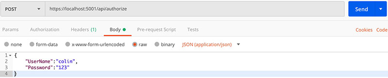
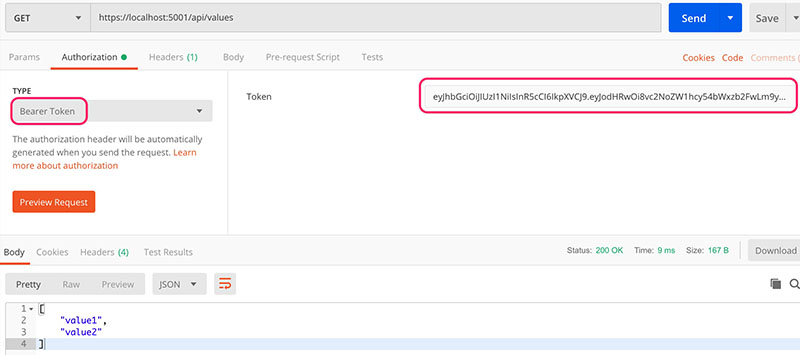
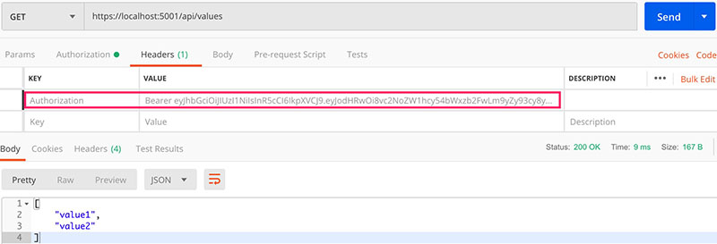

# JWT 认证授权

这里我们只介绍Asp.Net Core中基于`JWT`的认证授权使用方式。其认证授权原理参见[JWT原理](webapi-security.md/#22-jwt)。

## 1. 配置 Authentication
### 1.1 Jwt配置
配置文件。
```json
{
  "AllowedHosts": "*",
  "JwtSettings": {
    "Issuer": "http://localhost:5000",
    "Audience": "http://localhost:5000",
    "SecretKey": "your_custom_secret_key_more_than_16_bytes"
  }
}
```
`Issuer`和`Audience`分别代表`JWT`颁发者和接收方，非必须项。`SecretKey`长度至少为128 bits(16 bytes)。
添加配置项对应实体类。
```csharp
public class JwtSettings
{
    public string Issuer { get; set; }
    public string Audience { get; set; }
    public string SecretKey { get; set; }
}
```

### 1.2 Startup配置

在Startup中注册认证服务，添加认证中间件。

```csharp
public void ConfigureServices(IServiceCollection services)
{
    //注册JWT配置
    services.Configure<JwtSettings>(Configuration.GetSection(nameof(JwtSettings)));

    //读取JWT配置
    var jwtSettings = new JwtSettings();
    Configuration.Bind(nameof(jwtSettings), jwtSettings);

    //注册认证服务
    services.AddAuthentication(options =>
        {
            options.DefaultAuthenticateScheme = JwtBearerDefaults.AuthenticationScheme;
            options.DefaultChallengeScheme = JwtBearerDefaults.AuthenticationScheme;
        })
        .AddJwtBearer(options =>
        {
            options.TokenValidationParameters = new TokenValidationParameters
            {
                ValidIssuer = jwtSettings.Issuer,
                ValidAudience = jwtSettings.Audience,
                IssuerSigningKey = new SymmetricSecurityKey(Encoding.UTF8.GetBytes(jwtSettings.SecretKey))
            };
        });

    //注册授权服务
    services.AddAuthorization(options =>
        options.AddPolicy("sa", policy => policy.RequireClaim("SuperAdmin")));//添加一个名为 "sa"的Policy，要求必须存在"SuperAdmin"的Claim
    services.AddMvc().SetCompatibilityVersion(CompatibilityVersion.Version_2_2);
}

public void Configure(IApplicationBuilder app, IHostingEnvironment env)
{
    //添加认证中间件
    app.UseAuthentication();
    app.UseMvc();
}
```

## 2. 申请认证
```csharp
[Route("api/authorize")]
[ApiController]
public class AuthorizeController : ControllerBase
{
    private JwtSettings _jwtSettings;
    public AuthorizeController(IOptions<JwtSettings> jwtSettings)
    {
        _jwtSettings = jwtSettings.Value;
    }

    [HttpPost]
    public ActionResult Post([FromBody] User user)
    {
        //登录验证
        if (user.UserName != "colin" || user.Password != "123")
            return BadRequest("用户名或密码错误");

        //签发JWT
        var claims = new Claim[]
        {
            new Claim(ClaimTypes.Name, user.UserName),
            // new Claim(ClaimTypes.Role, "admin"),//授予admin角色
            new Claim("SuperAdmin", "true") //授予SuperAdmin Policy
        };
        var key = new SymmetricSecurityKey(Encoding.UTF8.GetBytes(_jwtSettings.SecretKey));
        var credentials = new SigningCredentials(key, SecurityAlgorithms.HmacSha256);
        var token = new JwtSecurityToken(_jwtSettings.Issuer, _jwtSettings.Audience, claims, DateTime.Now,
            DateTime.Now.AddMonths(1), credentials);

        var jwt = new JwtSecurityTokenHandler().WriteToken(token);
        return Ok(jwt);
    }
}

public class User
{
    public string UserName { get; set; }
    public string Password { get; set; }
}
```


## 3. 使用认证授权
```csharp
[Authorize("sa")]//基于Policy - "sa" 进行授权检查
[Route("api/values")]
[ApiController]
public class ValuesController : ControllerBase
{
    [HttpGet]
    public ActionResult<IEnumerable<string>> Get()
    {
        return new string[] {"value1", "value2"};
    }
}
```


标准的`Bearer Token`授权方式，在发送HTTP请求时会在`Request.Header`中添加`Authorization`项，内容是`Bearer Token`。如下图所示。


在需要认证授权的`Controller`或`Action`打上`Authorize`标记即可启用认证。现在更多推荐使用基于Policy的授权方式。