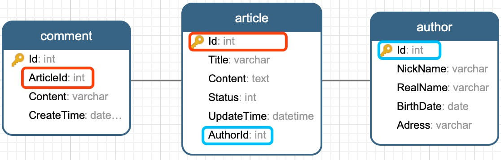
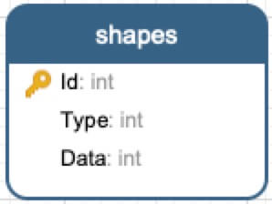

# Dapper 全攻略
* [1. 简介](#1-简介)
* [2. 项目/模型](#2-项目模型)
* [3. CRUD](#3-crud)
* [4. 其他](#4-其他)
* [5. Dapper Plus](#5-dapper-plus)

## 1. 简介
[Dapper](https://github.com/StackExchange/Dapper)是.NET下一个轻量级的ORM框架，它和Entity Framework或Nhibnate不同，属于轻量级的，并且是半自动的。也就是说实体类都要自己写。它没有复杂的配置文件，一个单文件就可以了。Dapper通过提供IDbConnection扩展方法来进行工作。

Dapper没有定义特定的数据库要求，它支持所有ADO.NET支持的数据库，如SQLite,SQL CE,Firebird,Oracle,MySQL,PostgreSQL,SQL Server等。

国外知名网站Stack Overflow生产环境使用Dapper进行数据库访问。
## 2. 项目/模型
下面我们通过一个简单的.Net Core控制台项目来快速入门Dappper使用。数据库使用MySQL。

### 2.1 创建项目
```sh
# 创建.net core控制台项目
$ dotnet new console -n DapperDemo

# 引用Dapper和MySQL nuget包
$ dotnet add package Dapper
$ dotnet add package MySql.Data
```
### 2.2 数据模型
#### 1) 数据库

```sql
CREATE TABLE `article` (
  `Id` int(11) NOT NULL AUTO_INCREMENT,
  `Title` varchar(255) NOT NULL,
  `Content` text NOT NULL,
  `Status` int(1) NOT NULL DEFAULT '1',
  `UpdateTime` datetime NOT NULL DEFAULT CURRENT_TIMESTAMP,
  `AuthorId` int(11) NOT NULL,
  PRIMARY KEY (`Id`)
) ENGINE=InnoDB DEFAULT CHARSET=utf8;

CREATE TABLE `author` (
  `Id` int(11) NOT NULL AUTO_INCREMENT,
  `NickName` varchar(255) NOT NULL,
  `RealName` varchar(255) NOT NULL,
  `BirthDate` date DEFAULT NULL,
  `Address` varchar(255) DEFAULT NULL,
  PRIMARY KEY (`Id`)
) ENGINE=InnoDB DEFAULT CHARSET=utf8;

CREATE TABLE `comment` (
  `Id` int(11) NOT NULL AUTO_INCREMENT,
  `ArticleId` int(11) NOT NULL,
  `Content` varchar(255) NOT NULL,
  `CreateTime` datetime NOT NULL DEFAULT CURRENT_TIMESTAMP,
  PRIMARY KEY (`Id`)
) ENGINE=InnoDB DEFAULT CHARSET=utf8;
```
#### 2) 数据模型
```csharp
public abstract class BaseModel
{
    public int Id { get; set; }
}

public class Author : BaseModel
{
    public string NickName { get; set; }
    public string RealName { get; set; }
    public DateTime? BirthDate { get; set; }
    public string Address { get; set; }

    public Author() { }
    public Author(string nickName, string realName)
    {
        NickName = nickName;
        RealName = realName;
    }
}

public class Article : BaseModel
{
    public string Title { get; set; }
    public string Content { get; set; }
    public ArticleStatus Status { get; set; }
    public DateTime UpdateTime { get; set; }
    public int AuthorId { get; set; }
    public Author Author { get; set; }
    public IEnumerable<Comment> Comments { get; set; }
}

public class Comment : BaseModel
{
    public int ArticleId { get; set; }
    public Article Article { get; set; }
    public string Content { get; set; }
    public DateTime CreateTime { get; set; }
}

public enum ArticleStatus
{
    Abnormal,
    Normal
}
```
## 3. CRUD
建立数据库连接。
```csharp
private static readonly string _connStr;
private static IDbConnection Cnn => new MySqlConnection(_connStr);
static DapperPlus()
{
    _connStr = "Server=127.0.0.1;Database=db_dapper;Uid=root;Pwd=xxxxxx;";
}
```
### 3.1 非查询操作
#### 1) 插入数据
Dapper可以使用同样的方式插入一条或多条数据。
```csharp
string sql = "INSERT INTO author (NickName,RealName) VALUES(@nickName,@RealName)";
var colin = new Author("Colin", "Colin Chang");
var robin = new Author("Robin", "Robin Song");

using (var cnn = Cnn)
{
    await cnnExecuteAsync(sql, new Author[] { colin, robin });
}
```
#### 2) 更新数据
```csharp
string sql = "UPDATE author SET Address=@address WHERE Id=@id";
using (var cnn = Cnn)
{
    await cnnExecuteAsync(sql, new { id = 1, address = "山东" });
}
```
#### 3) 删除数据
```csharp
string sql = "DELETE FROM author WHERE Id=@id";
using (var cnn = Cnn)
{
    await cnnExecuteAsync(sql,new {id=2});
}
```

### 3.2 查询操作
#### 1) 简单查询
```csharp      
var sql = "SELECT * FROM author WHERE Id=@id";
using (var cnn = Cnn)
{
    var authors = await cnnQueryAsync<Author>(sql, new { id = 1 });
}
```
常用的`IN ()`方式查询
```csharp
var sql = "SELECT * FROM author WHERE Id IN @ids";
using (var cnn = Cnn)
{
    var authors = await cnnQueryAsync<Author>(sql, new { ids = new int[] { 1, 2 } });
}
```
#### 2) 多表连接查询
此处演示使用三表连接查询，同时包含`1:1`和`1:N`的关系。
```csharp
var sql = @"SELECT * FROM article AS ar JOIN author AS au ON ar.AuthorId = au.Id LEFT JOIN `comment` AS c ON ar.Id = c.ArticleId";
var articles = new Dictionary<int, Article>();
using (var cnn = Cnn)
{
    var data = await cnnQueryAsync<Article, Author, Comment, Article>(sql,
    (article, author, comment) =>
    {
        //1:1
        article.Author=author;

        //1:N
        if (!articles.TryGetValue(article.Id, out Article articleEntry))
        {
            articleEntry = article;
            articleEntry.Comments = new List<Comment>{};
            articles.Add(article.Id, articleEntry);
        }
        articleEntry.Comments.Add(comment);
        return articleEntry;
    });
    // var result= data.Distinct();
}
var result = articles.Values;
//data.Distinct()和articles.Values都可以拿到数据，且数据内容相同。
```
`1:N`关系的连接查，查询出来的数据都是连接展开之后的全部数据记录，以上代码中的Lambda表达式会在遍历没条数据记录时执行一次。

#### 3) 多结果集查询
Dapper支持多结果集查询，可以执行任意多条查询语句。
```csharp
// 多结果集查询
string sqls = @"
    SELECT * FROM article WHERE Id=@id;
    SELECT * FROM `comment` WHERE ArticleId=@articleId;";

using (var cnn = Cnn)
{
    var reader = await cnnQueryMultipleAsync(sqls, new { id = 1, articleId = 1 });
    var articles = await reader.ReadAsync<Article>();
    var comments= await reader.ReadAsync<Comment>();

    var article = articles.FirstOrDefault();
    if (article != null)
        article.Comments = comments;
}
```
多结果集查询中，配合使用多条存在一定关联关系的查询语句，可以在一定程上巧妙的实现连接查询的效果，避免多表连接查询锁表的问题。以上代码即实现了此种效果。

## 3. 事务和存储过程

### 3.1 事务
```csharp
var scripts = new SqlScript[]
{
    new SqlScript("UPDATE article SET UpdateTime=NOW() WHERE Id=@id",new {id=2}),
    new SqlScript("UPDATE author SET BirthDate=NOW() WHERE Id=@id",new {id=1})
}

using (var cnn = Cnn)
{
    IDbTransaction tran = null;
    try
    {
        cnnOpen();
        tran = cnnBeginTransaction();
        foreach (var script in scripts)
            await cnnExecuteAsync(script.Sql, script.Param, tran, commandType: script.CommandType);

        tran.Commit();
    }
    catch
    {
        tran?.Rollback();
    }
}
```
以上演示用到的脚本模型类如下：
```csharp
public class SqlScript
{
    public string Sql { get; set; }
    public object Param { get; set; }
    public CommandType CommandType { get; set; }

    public SqlScript(string sql, object param = null, CommandType cmdType = CommandType.Text)
    {
        Sql = sql;
        Param = param;
        CommandType = cmdType;
    }
}
```
### 3.2 存储过程
Dapper完全支持存储过程。存储过程比较简单，代码就不展示了，读者可以自己按照自己想法随意创建。
```csharp
using (var cnn = Cnn)
{
    var users = cnnQuery<Author>("spGetAuthors", new {Id = 1}, commandType: CommandType.StoredProcedure);
}
```
使用传入传出参数的存储过程。
```csharp
var p = new DynamicParameters();
p.Add("@a", 11);
p.Add("@b", dbType: DbType.Int32, direction: ParameterDirection.Output);
p.Add("@c", dbType: DbType.Int32, direction: ParameterDirection.ReturnValue);
using (var cnn = Cnn)
{
    cnnExecute("spMagicProc", p, commandType: CommandType.StoredProcedure);
}

int b = p.Get<int>("@b");
int c = p.Get<int>("@c");
```

## 4. 其他
### 4.1 参数替换
Dapper支持对SQL语句中bool和数字类型进行替换。
```csharp
var sql = "SELECT * FROM article WHERE Status= {=Normal}";
using (var cnn = Cnn)
{
    var articles = await cnnQueryAsync<Article>(sql, new {ArticleStatus.Normal});
}
```
参数替换在特定类型字段中非常好用，比如"category id", "status code" or "region"

**参数替换并非采用参数话查询，虽然使用方便但是建议经过测试后谨慎使用。**

### 4.2 缓存查询
默认情况下Dapper会对执行SQL后的整个reader进行缓存，以减少数据库锁定和网络请求时间。然而执行大批量查询操作时缓存会占用大量内存空间，此时执行查询操作可以设置`buffered: false` 以禁用缓存。

### 4.3 ANSI编码
Dapper支持varchar类型参数,如果查询语句需要过滤一个varchar类型的字段可以使用以下方式指定编码:
```csharp
Query<Thing>("select * from Author where Address = @address", new {address = new DbString { Value = "山东", IsFixedLength = true, Length = 10, IsAnsi = true });
```
SQL Server中查询unicode and ANSI字段时务必使用unicode编码

### 4.4 多数据类型行
某些情况下同一行数据的某个字段可以是不同的数据类型。这种情况使用`IDataReader.GetRowParser`非常方便。



有shapes表结构如上图，我们可以根据Type字段将每行数据映射为`Circle`,`Square`,`Triangle`等具体类型对象。以下为示例代码：

<hr style="clear:both;height:0">
```csharp
var shapes = new List<IShape>();
using (var reader = connection.ExecuteReader("select * from Shapes"))
{
    // Generate a row parser for each type you expect.
    // The generic type <IShape> is what the parser will return.
    // The argument (typeof(*)) is the concrete type to parse.
    var circleParser = reader.GetRowParser<IShape>(typeof(Circle));
    var squareParser = reader.GetRowParser<IShape>(typeof(Square));
    var triangleParser = reader.GetRowParser<IShape>(typeof(Triangle));

    var typeColumnIndex = reader.GetOrdinal("Type");

    while (reader.Read())
    {
        IShape shape;
        var type = (ShapeType)reader.GetInt32(typeColumnIndex);
        switch (type)
        {
            case ShapeType.Circle:
            	shape = circleParser(reader);
            	break;
            case ShapeType.Square:
            	shape = squareParser(reader);
            	break;
            case ShapeType.Triangle:
            	shape = triangleParser(reader);
            	break;
            default:
            	throw new NotImplementedException();
        }

      	shapes.Add(shape);
    }
}
```

## 5. Dapper Plus
Dapper仅提供了SqlHelper常用功能和对象映射，我们通常会对Dapper进行二次封装扩展以更方便的使用Dapper。

[Dapper Plus](https://github.com/colin-chang/dapper-plus)扩展在无损Dapper性能的前提下，基本覆盖了日常数据操作。

Dapper Plus包含了上面的所有数据操作，案例中的代码已经包含在[单元测试](https://github.com/colin-chang/dapper-plus/tree/master/DapperPlus.Test)项目中。

源码地址：https://github.com/colin-chang/dapper-plus
