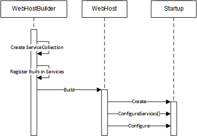

# Asp.Net Core 依赖注入使用
* [1. 依赖注入在管道构建过程中的使用](#1-依赖注入在管道构建过程中的使用)
* [2. 依赖服务注册](#2-依赖服务注册)
* [3. 依赖服务消费](#3-依赖服务消费)
    * [3.1 Controller/PageModel](#31-controllerpagemodel)
    * [3.2 View](#32-view)
    * [3.3 HttpContext获取实例](#33-httpcontext获取实例)

## 1. 依赖注入在管道构建过程中的使用
在ASP.NET Core管道的构架过程中主要涉及三个对象/类型，作为宿主的WebHost和它的创建者WebHostBuilder，以及注册到WebHostBuilder的Startup类型。 如下的代码片段体现了启动ASP.NET Core应用采用的典型编程模式：我们首先创建一个IWebHostBuilder对象，并将Startup类型注册到它之上。在调用Build方法创建WebHost之前，我们还可以调用相应的方式做其他所需的注册工作。当我们调用WebHost的Run方法之后，后者会利用注册的Startup类型来构建完整的管道。那么在管道的构建过程中，DI是如何被应用的呢？

```csharp
WebHost.CreateDefaultBuilder(args)
    .UseStartup<Startup>()
    .Xxx
    .Build()
    .Run();
```

DI在ASP.NET Core管道构建过程中的应用基本体现在下面这个序列图中。当我们调用WebHostBuilder的Build方法创建对应的WebHost的时候，前者会创建一个ServiceCollection对象，并将一系列预定义的服务注册在它之上。接下来WebHostBuilder会利用这个ServiceCollection对象创建出对应的ServiceProvider，这个ServiceProvider和ServiceCollection对象会一并传递给最终创建WebHost对象。当我们调用WebHost的Run方法启动它的时候，如果注册的Startup是一个实例类型，则会以构造器注入的方式创建对应的Startup对象。我们注册的Startup类型的构造函数是允许定义参数的，但是参数类型必须是预先注册到ServiceCollection中的服务类型。



注册的Startup方法可以包含一个可选的ConfigureServices方法，这个方法具有一个类型为IServiceCollection接口的参数。WebHost会将WebHostBuilder传递给它的ServiceCollection作为参数调用这个ConfigureServices方法，而我们则利用这个方法将注册的中间件和应用所需的服务注册到这个ServiceCollection对象上。在这之后，所有需要的服务（包括框架和应用注册的服务）都注册到这个ServiceCollection上面，WebHost会利用它创建一个新的ServiceProvider。WebHost会利用这个ServiceProvider对象以方法注入的方式调用Startup对象/类型的Configure方法，最终完成你对整个管道的建立。换句话会说，定义在Startup类型中旨在用于注册Middleware的Configure方法除了采用IApplicationBuilder作为第一个参数之外，它依然可以采用注册的任何一个服务类型作为后续参数的类型。

服务的注册除了现在注册的Startup类型的ConfigureServices方法之外，实际上还具有另一个实现方式，那就是调用IWebHostBuilder定义的ConfigureServices方法。当WebHostBuilder创建出ServiceCollection对象并完成了默认服务的注册后，我们通过调用这个方法所传入的所有Action&lt;IServiceCollection&gt;对象将最终应用到这个ServiceCollection对象上。

```csharp
public interface IWebHostBuilder
{
    IWebHostBuilder ConfigureServiecs(Action<IServiceCollection> configureServices);
}
```

值得一提的是，Startup类型的ConfigureServices方法是允许具有一个IServiceProvider类型的返回值，如果这个方法返回一个具体的ServiceProrivder，那么WebHost将不会利用ServiceCollection来创建ServiceProvider，而是直接使用这个返回的ServiceProvider来调用Startup对象/类型的Configure方法。这实际上是一个很有用的扩展点，使用它可以实现针对第三方DI框架（如Unity、Castle、Ninject和AutoFac等）的集成。

这里我们只是简单的介绍了Asp.Net Core程序启动的简单过程，具体实现细节属于Asp.Net Core框架的内容，我们将在后续[Asp.Net Core 程序启动源码和DI源码分析](disrc.md)中做详细介绍

## 2. 依赖服务注册
接下来我们通过一个实例来演示如何利用Startup类型的ConfigureServices来注册服务，以及在Startup类型上的两种依赖注入形式。如下面的代码片段所示，我们定义了两个服务接口（IFoo和IBar）和对应的实现类型（Foo和Bar）。其中服务Foo是通过调用WebHostBuilder的ConfigureServices方法进行注册的，而另一个服务Bar的注册则发生在Startup的ConfigureServices方法上。对于Startup来说，它具有一个类型为IFoo的只读属性，该属性在构造函数利用传入的参数进行初始化，不用说这体现了针对Startup的构造器注入。Startup的Configure方法除了ApplicationBuilder作为第一个参数之外，还具有另一个类型为IBar的参数，我们利用它来演示方法注入。

```csharp
public interface IFoo { }
public interface IBar { }
public class Foo : IFoo { }
public class Bar : IBar { }
 
public class Program
{
    public static void Main(string[] args)
    {
        WebHost.CreateDefaultBuilder(args)
            .ConfigureServices(services => services.AddSingleton<IFoo, Foo>())
            .UseStartup<Startup>()
            .Build()
            .Run();
    }
}
public class Startup
{
    public IFoo Foo { get; private set; }
    public Startup(IFoo foo)
    {
        this.Foo = foo;
    }    
    public void ConfigureServices(IServiceCollection services)
    {
        // 最常用的服务注册方式
        services.AddTransient<IBar, Bar>();
    }
    
    public void Configure(IApplicationBuilder app, IBar bar)
    {
        app.Run(async context =>
        {
            context.Response.ContentType = "text/html";
            await context.Response.WriteAsync($"IFoo=>{this.Foo}<br/>");
            await context.Response.WriteAsync($"IBar=>{bar}");
        });
    }
}
```

在Startup的Configure方法中，我们调用IApplicationBulder的Run方法注册了一个Middleware，后者将两个注入的服务的类型作为响应的内容输出。


另外，WebHostBuilder在创建ServiceCollection之后，会注册一些默认的服务（如IHostingEnvironment，ILoggerFactory等）。这些服务和我们自行注册的服务并没有任何区别，只要我们知道对应的服务类型，就可以通过注入的方式获取并使用它们。

ASP.NET Core的一些组件已经提供了一些实例的绑定，像AddMvc就是Mvc Middleware在 IServiceCollection上添加的扩展方法。

```csharp
public static IMvcBuilder AddMvc(this IServiceCollection services)
{
    if (services == null)
    {
        throw new ArgumentNullException(nameof(services));
    }
 
    var builder = services.AddMvcCore();
 
    builder.AddApiExplorer();
    builder.AddAuthorization();
    AddDefaultFrameworkParts(builder.PartManager);
    ...
}
```

## 3. 依赖服务消费
依赖服务之后就可以在需要的位置消费服务了。DI的[三种注入方式](di.md)，Asp.Net Core默认仅支持构造器注入方式和面向约定的方法注入(框架级别使用，如Starup的Config方法)。上面案例中在Startup的构造函数和Config方法分别体现了两种注入方式。

下面我们来演示在Asp.Net Core项目中Startup之外的位置如何消费DI服务。

### 3.1 Controller/PageModel
```csharp
private ILoginService<ApplicationUser> _loginService;
public AccountController(
  ILoginService<ApplicationUser> loginService)
{
  _loginService = loginService;
}
```
我们只要在控制器的构造函数里面写了这个参数，ServiceProvider就会帮我们注入进来。

### 3.2 View
在View中需要用@inject 再声明一下，起一个别名。
```html
@using MilkStone.Services;
@model MilkStone.Models.AccountViewModel.LoginViewModel
@inject ILoginService<ApplicationUser>  loginService
<!DOCTYPE html>
<html xmlns="http://www.w3.org/1999/xhtml">
<head></head>
<body>
  @loginService.GetUserName()
</body>
</html>
```

### 3.3 HttpContext获取实例
HttpContext下有一个RequestedService同样可以用来获取实例对象，不过这种方法一般不推荐。同时要注意GetService&lt;&gt;这是个范型方法，默认如果没有添加Microsoft.Extension.DependencyInjection的using，是不用调用这个方法的。

```csharp
HttpContext.RequestServices.GetService<ILoginService<ApplicationUser>>();
```

> 参考文献
* https://www.cnblogs.com/artech/p/dependency-injection-in-asp-net-core.html
* https://www.cnblogs.com/jesse2013/p/di-in-aspnetcore.html