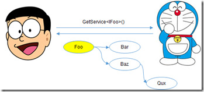

# 依赖注入（DI）

* [1. 容器提供服务](#1-容器提供服务)
* [2. 依赖注入方式](#2-依赖注入方式)
    * [2.1 构造器注入](#21-构造器注入)
    * [2.2 属性注入](#22-属性注入)
    * [2.3 方法注入](#23-方法注入)
* [3. Service Locator](#3-service-locator)
* [4. .Net Core中的DI](#4-net-core中的di)

## 1. 容器提供服务
和[基于IoC的设计模式](designmode.md)中介绍的工厂方法和抽象工厂模式一样，DI是一种“对象提供型”的设计模式，在这里我们将提供的对象统称为“服务”、“服务对象”或者“服务实例”。在一个采用DI的应用中，在定义某个服务类型的时候，我们直接将依赖的服务采用相应的方式注入进来。按照“面向接口编程”的原则，被注入的最好是依赖服务的接口而非实现。

在应用启动的时候，我们会对所需的服务进行全局注册。服务一般都是针对接口进行注册的，服务注册信息的核心目的是为了在后续消费过程中能够根据接口创建或者提供对应的服务实例。按照“好莱坞法则”，应用只需要定义好所需的服务，服务实例的激活和调用则完全交给框架来完成，而框架则会采用一个独立的“容器（Container）”来提供每一个服务实例。

框架用来提供服务的容器称为“DI容器”，也有很多人将其称为“IoC容器”，根据我们在《控制反转》针对IoC的介绍，我不认为后者是一个合理的称谓。DI容器之所以能够按照我们希望的方式来提供所需的服务是因为该容器是根据服务注册信息来创建的，服务注册了包含提供所需服务实例的所有信息。

举个简单的例子，我们创建一个名为Cat的DI容器类，那么我们可以通过调用具有如下定义的扩展方法GetService<T>从某个Cat对象获取指定类型的服务对象。我之所以将其命名为Cat，源于我们大家都非常熟悉的一个卡通形象“机器猫（哆啦A梦）”。机器猫的那个四次元口袋就是一个理想的DI容器，大熊只需要告诉哆啦A梦相应的需求，它就能从这个口袋中得到相应的法宝。DI容器亦是如此，服务消费者只需要告诉容器所需服务的类型（一般是一个服务接口或者抽象服务类），就能得到与之匹配的服务实例

```csharp
public static class CatExtensions
{  
    public static T GetService<T>(this Cat cat);
}
```

对于演示的MVC框架，我们在[基于IoC的设计模式](designmode.md)中分别采用不同的设计模式对框架的核心类型MvcEngine进行了改造，现在我们采用DI的方式并利用上述的这个Cat容器按照如下的方式对其进行重新实现，我们会发现MvcEngine变得异常简洁而清晰。

```csharp
 public class MvcEngine
{
    public Cat Cat { get; }
    public MvcEngine(Cat cat) => Cat = cat;
        
    public async Task StartAsync(Uri address)
    {
        var listener = Cat.GetService<IWebLister>();
        var activator = Cat.GetService<IControllerActivator>();
        var executor = Cat.GetService<IControllerExecutor>();
        var render = Cat.GetService<IViewRender>();
        await listener.ListenAsync(address);
        while (true)
        {
            var httpContext = await listener.ReceiveAsync();
            var controller = await activator.CreateControllerAsync(httpContext);
            try
            {
                var view = await executor.ExecuteAsync(controller, httpContext);
                await render.RendAsync(view, httpContext);
            }
            finally
            {
                await activator.ReleaseAsync(controller);
            }
        }
    }  
}
```

从服务消费的角度来讲，我们借助于一个服务接口对消费的服务进行抽象，那么服务消费程序针对具体服务类型的依赖可以转移到对服务接口的依赖上，但是在运行时提供给消费者的总是一个针对某个具体服务类型的对象。不仅如此，要完成定义在服务接口的操作，这个对象可能需要其他相关对象的参与，也就是说提供的这个服务对象可能具有针对其他对象的依赖。作为服务对象提供者的DI容器，在它向消费者提供服务对象之前就会根据服务实现类型和服务注册信息自动创建依赖的服务实例，并将后者注入到当前对象之中。

## 2. 依赖注入方式
从服务使用的角度来讲，我们借助于一个接口对服务进行抽象，那么依赖将转移到服务接口上。在运行时提供给消费者的则是具体服务类型的对象。

在具体服务类型中要实现服务接口定义的成员时，可能需要第三方对象辅助，这就产生了对第三方对象的依赖。DI容器在提供服务对象之前会自动注入这些第三方依赖到当前对象中。

服务消费程序调用GetService<IFoo>()方法向DI容器索取一个实现了IFoo接口的某个类型的对象，DI容器会根据预先注册的类型匹配关系创建一个类型为Foo的对象。此外，Foo对象依赖Bar和Baz对象的参与才能实现定义在服务接口IFoo之中的操作，所以Foo具有了针对Bar和Baz的直接依赖。至于Baz，它又依赖Qux，那么后者成为了Foo的间接依赖。对于DI容器最终提供的Foo对象，它所直接或者间接依赖的对象Bar、Baz和Qux都会预先被初始化并自动注入到该对象之中。



从编程的角度来讲，类型中的属性是依赖的一种主要体现形式，如果类型A中具有一个B类型的属性，那么A就对B产生了依赖。所谓依赖注入，我们可以简单地理解为一种针对依赖属性的自动初始化方式。具体来说，我们可以通过三种主要的方式达到这个目的，这就是接下来着重介绍的三种依赖注入方式。

### 2.1 构造器注入
构造器注入就在在构造函数中借助参数将依赖的对象注入到创建的对象之中。如下面的代码片段所示，Foo针对Bar的依赖体现在只读属性Bar上，针对该属性的初始化实现在构造函数中，具体的属性值由构造函数的传入的参数提供。当DI容器通过调用构造函数创建一个Foo对象之前，需要根据当前注册的类型匹配关系以及其他相关的注入信息创建并初始化参数对象。

 ```csharp
public class Foo
{
    public IBar Bar{get;}
    public Foo(IBar bar) =>Bar = bar;
}
 ```

 除此之外，构造器注入还体现在对构造函数的选择上面。如下面的代码片段所示，Foo类上面定义了两个构造函数，DI容器在创建Foo对象之前首先需要选择一个适合的构造函数。至于目标构造函数如何选择，不同的DI容器可能有不同的策略，比如可以选择参数最多或者最少的，或者可以按照如下所示的方式在目标构造函数上标注一个InjectionAttribute特性。

 ```csharp
public class Foo
{
    public IBar Bar{get;}
    public IBaz Baz {get;}

    [Injection]
    public Foo(IBar bar) =>Bar = bar;
    public Foo(IBar bar, IBaz):this(bar) =>Baz = baz;
}
 ```

### 2.2 属性注入
如果依赖直接体现为类的某个属性，并且该属性不是只读的，我们可以让DI容器在对象创建之后自动对其进行赋值进而达到依赖自动注入的目的。一般来说，我们在定义这种类型的时候，需要显式将这样的属性标识为需要自动注入的依赖属性以区别于该类型的其他普通的属性。如下面的代码片段所示，Foo类中定义了两个可读写的公共属性Bar和Baz，我们通过标注InjectionAttribute特性的方式将属性Baz设置为自动注入的依赖属性。对于由DI容器提供的Foo对象，它的Baz属性将会自动被初始化。

 ```csharp
public class Foo
{
    public IBar Bar{get; set;}

    [Injection]
    public IBaz Baz {get; set;}
}
 ```

### 2.3 方法注入
体现依赖关系的属性可以通过方法的形式初始化。如下面的代码片段所示，Foo针对Bar的依赖体现在只读属性上，针对该属性的初始化实现在Initialize方法中，具体的属性值由构造函数的传入参数提供。我们同样通过标注特性（InjectionAttribute）的方式将该方法标识为注入方法。DI容器在调用构造函数创建一个Foo对象之后，它会自动调用这个Initialize方法对只读属性Bar进行赋值。在调用该方法之前，DI容器会根据预先注册的类型映射和其他相关的注入信息初始化该方法的参数。

```csharp
public class Foo
{
    public IBar Bar{get;}

    [Injection]
    public void Initialize(IBar bar)=> Bar = bar;
}
```

除了上述这种通过DI容器在初始化服务过程中自动调用的实现在外，我们还可以利用它实现另一个更加自由的方法注入形式，后者在ASP.NET Core应用具有广泛的应用。ASP.NET Core在启动的时候会调用我们注册的Startup对象来完成中间件的注册，当我们在定义这个Startup类型的时候不需要让它实现某个接口，所以用于注册中间件的Configure方法其实没有一个固定的声明，我们可以按照如下的方式将任意依赖的服务直接注入到这个方法中。

```csharp
public class Startup
{
    public void Configure(IApplicationBuilder app, IFoo foo, IBar bar, IBaz baz);
}
```

类似的注入方式同样可以应用到中间件的定义中。与用于注册中间件的Startup类型一样，ASP.NET Core框架下的中间件类型同样不需要实现某个预定义的接口，用于处理请求的InvokeAsync或者Invoke方法上可以按照如下的方式注入任意的依赖服务。

```csharp
public class FoobarMiddleware
{
    private readonly RequestDelegate _next; 
    public FoobarMiddleware(RequestDelegate next) =>_next = next;
    public Task InvokeAsync(HttpContext httpContext, IFoo foo, IBar bar, IBaz baz);
}
```

上面这种方式的方法注入促成了一种“面向约定”的编程方式，由于不再需要实现某个预定义的接口或者继承某一个预定义的类型，需要实现的方法的声明也就少了对应的限制，这样就可用采用最直接的方式将依赖的服务注入到所需的方法中。

对于上面介绍的这几种注入方式，构造器注入是最为理想的形式，我个人不建议使用属性注入和方法注入（上面介绍这种基于约定的方法注入除外）。我们定义的服务类型应该是独立自治的，我们不应该对它运行的环境做过多的假设和限制，也就是说同一个服务类型可以使用在框架A中，也可以实现在框架B上；在没有使用任何DI容器的应用中可以使用这个服务类型，当任何一种DI容器被使用到应用中之后，该服务类型依旧能够被正常使用。对于上面介绍的这三种注入方式，只有构造器注入能够达到这个目的，而属性注入和方法注入都依赖于某个具体的DI框架来实现针对依赖属性的自动赋值和依赖方法的自动调用。

## 3. Service Locator
假设我们需要定义一个服务类型Foo，它依赖于另外两个服务Bar和Baz，后者对应的服务接口分别为IBar和IBaz。如果当前应用中具有一个DI容器（假设类似于我们在上面定义的Cat），那么我们可以采用如下两种方式来定义这个服务类型Foo。

```csharp
public class Foo : IFoo
{
    public IBar Bar { get; }
    public IBaz Baz { get; }
    public Foo(IBar bar, IBaz baz)
    {
        Bar = bar;
        Baz = baz;
    }  
    public async Task InvokeAsync()
    {
        await Bar.InvokeAsync();
        await Baz.InvokeAsync();
    }
}

public class Foo : IFoo
{
    public Cat Cat { get; }
    public Foo(Cat cat) => Cat = cat; 
    public async Task InvokeAsync()
    {
        await Cat.GetService<IBar>().InvokeAsync();
        await Cat.GetService<IBaz>().InvokeAsync();
    }
}
```

从表面上看，上面提供的这两种服务类型的定义方式貌似都不错，至少它们都解决针对依赖服务的耦合问题，将针对服务实现的依赖转变成针对接口的依赖。那么哪一种更好呢？我想有人会选择第二种定义方式，因为这种定义方式不仅仅代码量更少，针对服务的提供也更加直接。我们直接在构造函数中“注入”了代表“DI容器”的Cat对象，在任何使用到依赖服务的地方，我们只需要利用它来提供对应的服务实例就可以了。

但事实上第二种定义方式采用的设计模式根本就不是“依赖注入”，而是一种被称为“Service Locator”的设计模式。Service Locator模式同样具有一个通过服务注册创建的全局的容器来提供所需的服务实例，该容器被称为“Service Locator”。“DI容器”和“Service Locator”实际上是同一事物在不同设计模型中的不同称谓罢了，那么DI和Service Locator之间的差异体现在什么地方呢？

我们觉得可以从“DI容器”和“Service Locator”被谁使用的角度来区分这两种设计模式的差别。在一个采用依赖注入的应用中，我们只需要采用标准的注入形式将服务类型定义好，并在应用启动之前完成相应的服务注册就可以了，框架自身的引擎在运行过程中会利用DI容器来提供当前所需的服务实例。换句话说，DI容器的使用者应该是框架而不是应用程序。Service Locator模式显然不是这样，很明显是应用程序在利用它来提供所需的服务实例，所以它的使用者是应用程序。

我们也可以从另外一个角度区分两者之间的差别。由于依赖服务是以“注入”的方式来提供的，所以采用依赖注入模式的应用可以看成是将服务“推”给DI容器，Service Locator模式下的应用则是利用Service Locator去“拉”取所需的服务，这一推一拉也准确地体现了两者之间的差异。那么既然两者之间有差别，究竟孰优孰劣呢？

早在2010年，Mark Seemann就在它的博客中将Service Locator视为一种“反模式（Anti-Pattern）”，虽然也有人对此提出不同的意见，但我个人是非常不推荐使用这种设计模式的。我反对使用Service Locator与上面提到的反对使用属性注入和方法注入具有类似的缘由。

我们既然将一组相关的操作定义在一个能够复用的服务中，不但要求服务自身具有独立和自治的特性，也要求服务之间的应该具有明确的边界，服务之间的依赖关系应该是明确的而不是模糊的。不论是采用属性注入或者构造器注入，还是使用Service Locator来提供当前依赖的服务，这无疑为当前的应用增添了一个新的依赖，即针对DI容器或者Service Locator的依赖。

当前服务针对另一个服务的依赖与针对DI容器或者Service Locator的依赖具有本质的不同，前者是一种基于类型的依赖，不论是基于服务的接口还是实现类型，这是一种基于“契约”的依赖。这种依赖不仅是明确的，也是有保障的。但是DI容器也好，Service Locator也罢，它们本质上都是一个黑盒，它能够提供所需服务的前提已经预先添加了对应的服务注册。

正因为如此，ASP.NET Core框架使用的DI框架只支持构造器注入，而不支持属性和方法注入（类似于Startup和中间件基于约定的方法注入除外）。但是我们很有可能不知不觉地会按照Service Locator模式来编写我们的代码，从某种意义上讲，当我们在程序中使用IServiceProvider（表示DI容器）来提取某个服务实例的时候，就意味着我们已经在使用Service Locator模式了，所以当我们遇到这种情况下的时候应该多想一想是否一定需要这么做。虽然我们提倡尽可能避免使用Service Locator模式，但是有的时候（有其是在编写框架或者组件的时候），我们是无法避免使用IServiceProvider来提取服务。

## 4. .Net Core中的DI
.NET Core针对依赖注入的编程主要体现在两个方面：
* 服务注册：创建一个ServiceCollection对象并将服务注册信息以ServiceDescriptor对象的形式添加其中
* 服务消费： 通过ServiceCollection对象创建对应的ServiceProvider并利用它提供我们需要的服务实例

我们将在后续章节中对[服务注册](register.md)和[服务消费](consume.md)进行详细的阐述。

> 参考文献
https://www.cnblogs.com/artech/p/net-core-di-03.html