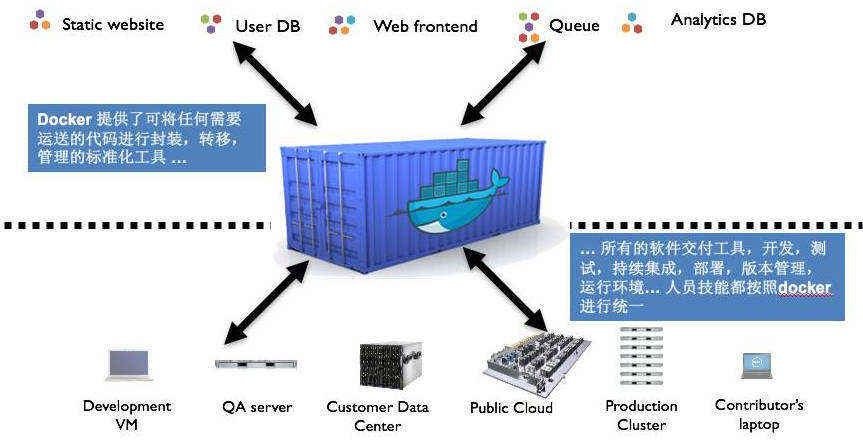
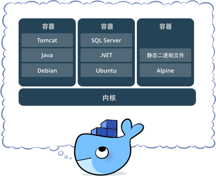
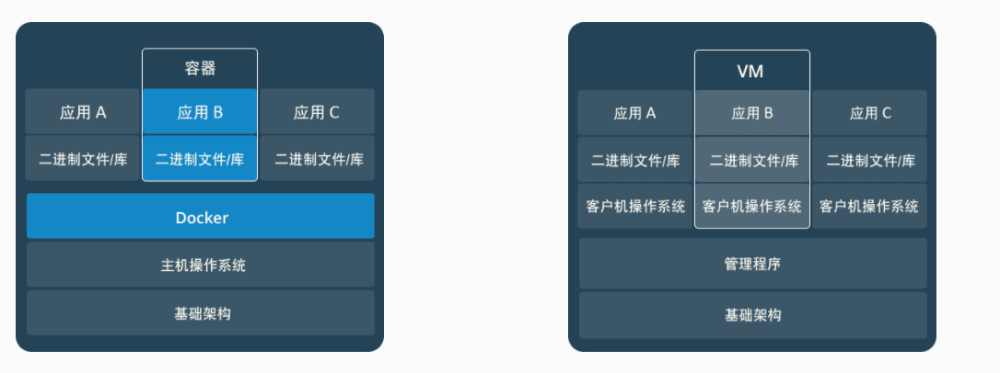

# Docker — 领先的软件容器平台

* [1. What's the problem](#1-whats-the-problem)
* [2. Docker特点](#2-docker特点)
* [3. Docker基本概念](#3-docker基本概念)
    * [3.1 镜像(Image)](#31-镜像image)
    * [3.2 容器(Container)](#32-容器container)
    * [3.3 仓库(Repository)](#33-镜像repository)
* [4. 容器与虚拟机](#4-容器与虚拟机)    

## 1. What's the problem
系统开发常遇到以下问题：
* A电脑运行没问题,B电脑上运行有问题。俗称“我这里没问题呀”🤦‍‍‍🤦‍🤦‍
* 服务器只运行一个应用造成资源浪费,但是运行多个应用又怕互相干扰
* 在开发人员电脑上开发的系统,跑到服务器上时需要重新安装软件、安装开发包、系统配置,不同系统上可能操作还不一样

...

以上问题可以用虚拟机技术解决,但是性能低,硬件浪费严重。于是Docker技术应用而生。

## 2. Docker特点

Docker 是世界领先的软件容器平台,具有以下特点。

* 轻量

    Docker在操作系统上分出多个独立的区域，称作“容器”(Container)。各个容器之间互相“基本隔离”,每个容器可以单独有自己的系统配置、安装的软件、安装 的开发包,各个容器之间的软件“基本”不会互相干扰。在一台机器上运行的多个Docker容器可以共享这台机器的操作系统内核；它们能够迅速启动，只需占用很少的计算和内存资源。镜像是通过文件系统层进行构造的，并共享一些公共文件。这样就能尽量降低磁盘用量，并能更快地下载镜像。Docker性能损耗比虚拟机低很多,都是进程跑在原生操作性系统下,基本没有性能损耗。

* 标准化

    Docker 容器基于开放式标准。能够在不同平台环境下快速的移植，而不用担心运行环境的变化导致应用无法正常运行的情况。目前支持Linux/Windows/MacOS,
    但**不支持32位系统**。

* 伸缩性

    Docker还可以更好的满足对于可伸缩性的要求。Docker可以按需自动扩容,自动启动多个服务器、创建多个容器运行更多集群服务器。

* 即抛性

    Docker部署系统要求可以“即抛”,不保存状态数据。一个容器不再使用时，直接删除即可,不会保存相关数据。

* 安全性

    Docker赋予应用的隔离性不仅限于彼此隔离，还独立于底层的基础设施。Docker 默认提供最强的隔离，因此应用出现问题，也只是单个容器的问题，而不会波及到整台机器。

## 3. Docker基本概念
### 3.1 镜像(Image)
操作系统分为内核和用户空间。对于 Linux 而言，内核启动后，会挂载 root 文件系统为其提供用户空间支持。而Docker 镜像（Image），就相当于是一个 root 文件系统。比如官方镜像 ubuntu 16.04 就包含了完整的一套 Ubuntu 16.04 最小系统的 root 文件系统。

Docker 镜像是**一个特殊的文件系统**，除了提供容器运行时所需的程序、库、资源、配置等文件外，还包含了一些为运行时准备的一些配置参数（如匿名卷、环境变量、用户等）。镜像不包含任何动态数据，其内容在构建之后也不会被改变。

Docker 设计时，就充分利用 Union FS的技术，将其设计为 **分层存储的架构** 。 镜像实际是由多层文件系统联合组成。

镜像构建时，会一层层构建，前一层是后一层的基础。每一层构建完就不会再发生改变，后一层上的任何改变只发生在自己这一层。比如，删除前一层文件的操作，实际不是真的删除前一层的文件，而是仅在当前层标记为该文件已删除。在最终容器运行的时候，虽然不会看到这个文件，但是实际上该文件会一直跟随镜像。因此，在构建镜像的时候，需要额外小心，每一层尽量只包含该层需要添加的东西，任何额外的东西应该在该层构建结束前清理掉。

分层存储的特征还使得镜像的复用、定制变的更为容易。甚至可以用之前构建好的镜像作为基础层，然后进一步添加新的层，以定制自己所需的内容，构建新的镜像。

### 3.2 容器(Container)

镜像（ Image ）和容器（ Container ）的关系，就像是面向对象程序设计中的 类 和 实例一样，镜像是静态的定义，容器是镜像运行时的实体。容器可以被创建、启动、停止、删除、暂停等。

容器的实质是进程，但与直接在宿主执行的进程不同，容器进程运行于属于自己的独立的命名空间。因此容器可以拥有自己的 root 文件系统、自己的网络配置、自己的进程空间，甚至自己的用户 ID 空间。容器内的进程是运行在一个隔离的环境里，使用起来，就好像是在一个独立于宿主的系统下操作一样。这种特性使得容器封装的应用比直接在宿主运行更加安全。也因为这种隔离的特性，很多人初学 Docker 时常常会混淆容器和虚拟机。

前面讲过镜像使用的是分层存储，容器也是如此。每一个容器运行时，是以镜像为基础层，在其上创建一个当前容器的存储层，我们可以称这个为容器运行时读写而准备的存储层为容器存储层。容器存储层的生存周期和容器一样，容器消亡时，容器存储层也随之消亡。因此，任何保存于容器存储层的信息都会随容器删除而丢失。

按照 Docker 最佳实践的要求，**容器不应该向其存储层内写入任何数据，容器存储层要保持无状态化。**所有的文件写入操作，都应该使用 数据卷（Volume）、或者绑定宿主目录，在这些位置的读写会跳过容器存储层，直接对宿主（或网络存储）发生读写，其性能和稳定性更高。

数据卷的生存周期独立于容器，容器消亡，数据卷不会消亡。因此，使用数据卷后，容器删除或者重新运行之后，数据却不会丢失。

### 3.3 仓库(Repository)  
镜像构建完成后，可以很容易的在当前宿主机上运行，但如果需要在其它服务器上使用这个镜像，我们就需要一个集中的存储、分发镜像的服务，Docker Registry 就是这样的服务。

一个 Docker Registry 中可以包含多个仓库(Repository)；每个仓库可以包含多个标签(Tag)；每个标签对应一个镜像。通常，一个仓库会包含同一个软件不同版本的镜像，而标签就常用于对应该软件的各个版本。我们可以通过 <仓库名>:<标签> 的格式来指定具体是这个软件哪个版本的镜像。如果不给出标签，将以 latest 作为默认标签。以 Ubuntu 镜像 为例，ubuntu 是仓库的名字，其内包含有不同的版本标签，如，14.04 ,16.04。我们可以通过 ubuntu:14.04，或者 ubuntu:16.04 来具体指定所需哪个版本的镜像。如果忽略了标签，比如 ubuntu ，那将视为 ubuntu:latest 。

仓库名经常以两段式路径形式出现，比如 jwilder/nginx-proxy ，前者往往意味着 Docker Registry 多用户环境下的用户名，后者则往往是对应的软件名。但这并非绝对，取决于所使用的具体 Docker Registry 的软件或服务。

#### 1) Docker Registry 公开服务
Docker Registry 公开服务是开放给用户使用、允许用户管理镜像的 Registry 服务。一般这类公开服务允许用户免费上传、下载公开的镜像，并可能提供收费服务供用户管理私有镜像。

最常使用的 Registry 公开服务是官方的 [Docker Hub](https://hub.docker.com/)，这也是默认的 Registry，并拥有大量的高质量的官方镜像。除此以外，还有 CoreOS 的 Quay.io，CoreOS 相关的镜像存储在这里；Google 的 Google Container Registry，Kubernetes 的镜像使用的就是这个服务。国内也有一些云服务商提供类似于 Docker Hub 的公开服务。比如 [网易云镜像服务](https://www.163yun.com/product/repo)、[DaoCloud 镜像市场](https://hub.daocloud.io/)、[阿里云镜像库](https://www.aliyun.com/product/containerservice?utm_content=se_1292836)等。

由于某些原因，在国内访问这些服务可能会比较慢。国内的一些云服务商提供了针对 Docker Hub 的镜像服务（ Registry Mirror ），这些镜像服务被称为加速器。常见的有 阿里云加速器、DaoCloud 加速器 等。使用加速器会直接从国内的地址下载 Docker Hub 的镜像，比直接从 Docker Hub 下载速度会提高很多。

#### 2) 私有 Docker Registry
除了使用公开服务外，用户还可以在本地搭建私有 Docker Registry。Docker 官方提供了Docker Registry 镜像，可以直接使用做为私有 Registry 服务。

开源的 Docker Registry 镜像只提供了 Docker Registry API 的服务端实现，足以支持docker命令，不影响使用。但不包含图形界面，以及镜像维护、用户管理、访问控制等高级功能。在官方的商业化版本 Docker Trusted Registry 中，提供了这些高级功能。

除了官方的 Docker Registry 外，还有第三方软件实现了 Docker Registry API，甚至提供了用户界面以及一些高级功能。比如，VMWare Harbor 和 Sonatype Nexus。

## 4. 容器与虚拟机

传统虚拟机技术是虚拟出一套硬件后，在其上运行一个完整操作系统，在该系统上再运行所需应用进程；而容器内的应用进程直接运行于宿主的内核，容器内没有自己的内核，而且也没有进行硬件虚拟。因此容器要比传统虚拟机更为轻便。

* 容器是一个应用层抽象，用于将代码和依赖资源打包在一起。多个容器可以在同一台机器上运行，共享操作系统内核，但各自作为独立的进程在用户空间中运行 。与虚拟机相比，容器占用的空间较少（容器镜像大小通常只有几十兆），瞬间就能完成启动。

* 虚拟机 (VM) 是一个物理硬件层抽象，用于将一台服务器变成多台服务器。管理程序允许多个 VM 在一台机器上运行。每个VM都包含一整套操作系统、一个或多个应用、必要的二进制文件和库资源，因此 占用大量空间 。而且 VM 启动也十分缓慢 。

两者有不同的使用场景。虚拟机更擅长于彻底隔离整个运行环境。例如，云服务提供商通常采用虚拟机技术隔离不同的用户。而 Docker通常用于隔离不同的应用 ，例如前端，后端以及数据库。

> 参考文献
* https://blog.csdn.net/aa1215018028/article/details/80823659
* https://blog.csdn.net/wo18237095579/article/details/80480882