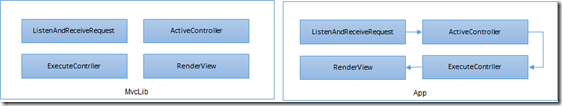
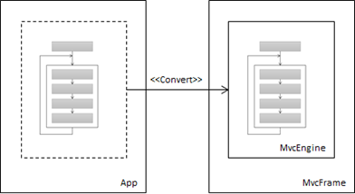
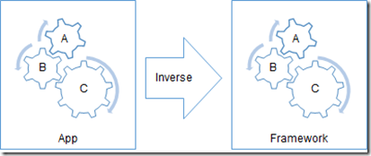
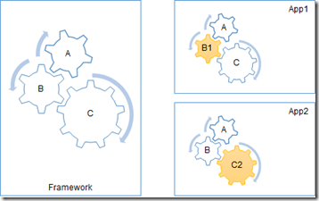
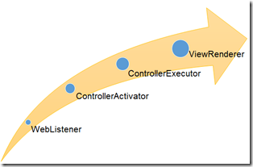
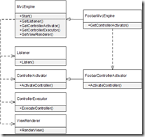
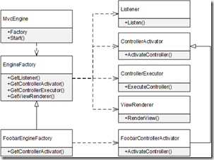

# 控制反转（IoC）
* [1. 流程控制反转](#1-流程控制的反转)
* [2. 定制流程](#2-定制流程)
* [3. IoC原则](#3-ioc原则)
    * [3.1 模板方法（Template Method）](#31-模板方法（template-method）)
    * [3.2 工厂方法（Factory Method）](#32-工厂方法（factory-method）)
    * [3.3 抽象工厂（Abstract Factory）](#33-抽象工厂（abstract-factory）)

IoC主要体现了这样一种设计思想：通过将一组通用流程的控制从应用转移到框架之中以实现对流程的复用，同时采用“好莱坞原则”是应用程序以被动的方式实现对流程的定制。我们可以采用若干设计模式以不同的方式实现IoC。

## 1. 流程控制反转
很多人将IoC说成是一种“面向对象的设计模式”，但在我个人看来IoC不能算作一种“设计模式”，其自身也与“面向对象”没有直接的关系。很多人之所以不能很准确地理解IoC源于他们忽略了一个最根本的东西，那就是IoC这个短语。换句话说，很多人之所以对IoC产生了诸多误解是因为他们忽略了IoC的定义。

IoC的全名Inverse of Control，翻译成中文就是“控制反转”或者“控制倒置”。控制反转也好，控制倒置也罢，它体现的意思是控制权的转移，即原来控制权在A手中，现在需要B来接管。那么具体对于软件设计来说，IoC所谓的控制权的转移具有怎样的体现呢？要回答这个问题，就需要先了解IoC的C（Control）究竟指的是怎样一种控制，在我看来这里所谓的控制更多地体现为一种“流程的控制”。

我们通过一个具体事例来说明传统的设计在采用了IoC之后针对流程的控制是如何实现反转的。比如说我们现在设计一个针对Web的MVC类库，不妨将其命名为MvcLib。MvcLib提供了如下所示的API帮助我们完成整个HTTP请求流程中的主要任务。具体来说，ListenAndReceiveRequest方法启动一个监听器绑定到指定的地址进行请求的监听，接收到的请求通过一个Request对象返回。ActivateController方法根据接收到的请求解析并激活请求的目标Controller。ExecuteContrller方法执行激活的Controller并返回一个表示视图的View对象。RenderView最终将View对象转换成HTML并作为当前请求响应的内容。

```csharp
public static class MvcLib
{
    public static Request ListenAndReceiveRequest(Uri address);
    public static Controller ActivateController (Request request);
    public static View ExecuteContrller(Controller controller);
    public static void RenderView(View view);
}
```

现在我们在这个MvcLib的基础上创建一个真正的MVC应用，那么除了按照MvcLib的规范自定义具体的Controller和View之外，我们还需要自行控制从请求的监听与接收、Controller的激活与执行以及View的最终呈现在内的整个流程，这样一个执行流程反映在如下所示的代码中。

```csharp
public class App
{
    static void Main(string[] args)
    {
        Uri address = new Uri("http://localhost/mvcapp");
        while (true)
        {
            Request request = MvcLib.ListenAndReceiveRequest(address);
            Task.Run(()=> ProcessRequest(request));
        }
    }
 
    private static void ProcessRequest(Request request)
    {
        Controller controller = MvcLib.ActiveController(request);
        View view = MvcLib.ExecuteContrller(controller);
        MvcLib.RenderView(view);
    }
}
```

这个例子体现了右下图所示的流程控制方式，即我们设计的类库（MvcLib）仅仅通过API的形式提供某种单一功能的实现，作为类库消费者的应用程序（App）则需要自行编排整个工作流程。如果从重用的角度来讲，这里被重用的仅限于实现某个环节单一功能的代码，编排整个工作流程的代码并没有得到重用。



当我们构建一个应用的时候，我们不仅仅是需要一个能够提供API的类库，实际上更理想的形式是直接在一个现有的框架上构架我们的应用。类库（Library）和框架（Framework）的不同之处在于，**前者往往只是提供实现某种单一功能的API，而后者则针对一个目标任务对这些单一功能进行编排形成一个完整的流程，这个流程在一个引擎的驱动下被执行。**

在我们上面演示MvcLib来说，使用它的应用程序需要自行控制整个HTTP请求的处理流程，实际上这是一个很“泛化”的工作流程，几乎所有的MVC应用均采用这样的流程监听、接收请求并最终对请求予以响应。如果我们将这个流程实现在一个MVC框架之中，由它构建的所有MVC应用就可以直接使用这个请求处理流程，而并不需要自行重复实现它。

现在我们将MvcLib从类库改造成一个框架，并姑且将其称为MvcFrame。如下图所示，MvcFrame的核心是一个被称为MvcEngine的执行引擎，它驱动一个编排好的工作流对HTTP请求进行一致性处理。如果我们利用MvcFrame构建一个具体的MVC应用，除了根据我们的业务需求定义相应的Controller和View之外，我们只需要初始化这个引擎并直接启动它即可。如果你曾经开发过ASP.NET MVC应用，你会发现ASP.NET MVC就是这么一个框架。



有了上面演示的这个例子作为铺垫，我们应该很容易理解IoC所谓的控制反转了。总的来说，IoC是我们设计框架所采用的设计思想，所谓的控制反转即是按照如右图所示的方式将原来实现在应用程序流程控制转移到框架中。被转移的是一个泛化的可重用的处理流程，所以IoC符合软件设计一个基本的原则，即重用性。



## 2. 定制流程
我们采用IoC实现了流程控制从应用程序向框架自身的反转，但是这个被反转的仅仅是一个泛化的流程，任何一个具体的应用都可能需要对组成该流程的某些环节进行定制。如下图所示，我们将一个泛化的工作流程（A=>B=>C）被定义在框架之中，建立在该框架的两个应用需要对组成这个流程的某些环节进行定制。比如步骤A和C可以被App1重用，但是步骤B却需要被定制（B1），App2则重用步骤A和B，但是需要按照自己的方式（C2）处理步骤C。



IoC将对流程的控制从应用程序转移到框架之中，框架利用一个引擎驱动整个流程的执行。换句话说，应用程序无需关心该工作流程的细节，它只需要启动这个引擎即可。但是这个引擎一旦被启动，框架就会完全按照预先编排好的流程进行工作，如果应用程序希望整个流程按照自己希望的方式被执行，针对流程的定制一般在发生在启动引擎之前。

一般来说，框架会以相应的形式提供一系列的扩展点，应用程序则通过定义扩展的方式实现对流程某个环节的定制。在引擎被启动之前，应用程序将所需的扩展注册到框架之中。一旦引擎被正常启动，这些注册的扩展会自动参与到整个流程的执行过程中。

虽然应用程序是框架引擎的启动着，但是一旦引擎被启动之后它就丧失了对流程的控制，应用程序对流程的定制不是在执行过程中对框架的干预来完成的，而只需要在流程执行之前就将定制的部分准备好，框架自身在执行过程中会智能地选择它们。从这个意义上讲，IoC对流程的定制遵循着这样一个原则，即“Don't call us, we'll call you!”，它被称为**好莱坞原则。**

综上所述，IoC一方面通过流程控制从应用程序向框架的反转实现了针对流程自身的重用，另一方面采用“好莱坞原则”使得这个被重用的流程可能自由地被定制，这两个因素实际上决定了框架自身的价值。重用让框架不仅仅是为应用程序提供实现单一功能的API，而是提供一整套可执行的解决方案；可定制则使我们可以为不同的应用程序对框架进行定制，这无疑让框架可以使用到更多的应用之中。


## 3. IoC原则
正如我们在上面提到过的，很多人将IoC理解为一种“面向对象的设计模式”，实际上IoC自身不仅与面向对象没有必然的联系，它也算不上是一种设计模式。一般来讲，设计模式提供了一种解决某种具体问题的方案，但是IoC既没有一个针对性的问题领域，其自身没有提供一种可实施的解决方案，所以我更加倾向于将IoC视为一种设计原则，实际上很多我们熟悉的设计模式背后采用了IoC原则。

### 3.1 模板方法（Template Method）
提到IoC，很多人首先想到的是DI，但是在我看来与IoC联系得最为紧密的则是另一种被称为“模板方法”的设计模式。模板方法模式与IoC的意图可以说完全一致，该模式主张将一个可复用的工作流程或者由多个步骤组成的算法定义成模板方法，组成这个流程或者算法的步骤则实现在相应的虚方法之中，模板方法根据流程先后调用这些虚方法。所有这些方法均定义在同一个类中，我们可以通过派生该类并重写相应的虚方法达到对流程定制的目的。

对于上面我们演示的这个MVC的例子，我们可以将整个请求处理流程实现在如下一个MvcEngine类中，请求的监听与接收、目标Controller的激活与执行以及View的呈现则分别定义在四个受保护的虚方法中，模板方法Start根据预定义的请求处理流程先后调用这四个方法。

 ```csharp
public class MvcEngine
{
    public void Start(Uri address)
    {
        while (true)
        {
            Request request = this.OnListenAndReceiveRequest(address);
            Task.Run(() =>
            {
                Controller controller = this.OnActivateController(request);
                View view = this.OnExecuteContrller(controller);
                this.OnRenderView(view);
            });
        }
    }
    protected virtual Request OnListenAndReceiveRequest(Uri address) ;
    protected virtual Controller OnActivateController(Request request) ;
    protected virtual View OnExecuteContrller(Controller controller) ;        
    protected virtual void OnRenderView(View view) ;
}
 ```

对于具体的应用来说，如果定义在MvcEngine针对请求的处理方式完全符合它的要求，它只需要创建这个一个MvcEngine对象，然后指定一个对应的基地址调用模板方法Start开启这个MVC引擎即可。如果该MVC引擎处理请求的某个环节不能满足它的要求，它可以创建MvcEngine的派生类，并重写实现该环节的相应虚方法即可。比如说定义在某个应用程序中的Controller都是无状态的，它希望采用单例（Singleton）的方式重用已经激活的Controller以提高性能，那么它就可以按照如下的方式创建一个自定义的FoobarMvcEngine并按照自己的方式重写OnActivateController方法既可。

```csharp
public class FoobarMvcEngine : MvcEngine
{
    protected override View OnExecuteContrller(Controller controller)
    {
        // <<自定义实现>>
    }
}
```

模板方法如果结合“事件注册”往往可以使应用程序对流程的定制变得更加自由。如下面的代码片段所示，我们为Controller的激活与执行以及View的呈现定义了六个事件，它们分别在这个三个环节开始之前和结束之后被触发。这么一个MvcEngine可以直接被使用，应用程序只需要注册相应的事件完成对请求处理流程的定制。

```csharp
public class MvcEngine
{
    //其他成员
    protected virtual Controller OnActivateController(Request request) ;
    protected virtual View OnExecuteContrller(Controller controller) ;        
    protected virtual void OnRenderView(View view) ;
 
    public EventHandler<ControllerActivationEventArgs> ControllerActivating;
    public EventHandler<ControllerActivationEventArgs> ControllerActivated;
    public EventHandler<ControllerExecutionEventArgs> ControllerExecuting;
    public EventHandler<ControllerExecutionEventArgs> ControllerExecuted;
    public EventHandler<ViewRenderEventArgs> ViewRendering;
    public EventHandler<ViewRenderEventArgs> ViewRendered;
}
```

### 3.2 工厂方法（Factory Method）
对于一个复杂的流程来说，我们倾向于将组成该流程的各个环节实现在相应独立的组件之中，那么针对流程的定制就可以通过提供不同组件的形式来实现。我们知道23种设计模式之中有一种重要的类型，那就是“创建型模式”，比如常用的“工厂方法”和“抽象工厂”，那么IoC所体现的针对流程的共享与定制可以通过它们来完成。

3-5所谓的工厂方法，说白了就是在某个类中用于提供依赖对象的方法，这个方法可以是一个单纯的虚方法，也可以是具有默认实现的虚方法，至于方法声明的返回类型，可以是一个接口或者抽象类，也可以是未被封闭（Sealed）的具体类型。作为它的派生类型，它可以实现或者重写工厂方法以提供所需的具体对象。

同样以我们的MVC框架为例，我们让独立的对象来完成组成整个请求处理流程的四个核心环节。具体来说，我们分别定义了四个核心的类型（Listener、ControllerActivator、ControllerExecutor和ViewGenderer）来分别负责请求监听与接收、Controller的激活、Controller的执行以及View的呈现。这四个对象按照如右图所示的顺序相互协作完成对请求的处理。



如下所示的Listener、ControllerActivator、ControllerExecutor和ViewGenderer这四个类型的简单定义。我们没有将它们定义成单纯的抽象类或者接口，而是未被封闭可以被继承的一般类型，定义其中的虚方法具有默认的实现。只有这些默认的实现方式无法满足应用程序具体需求的时候，我们才需要定义相应的派生类。

```csharp
public class Listener
{
    public virtual Request Listen(Uri address) ;
}
 
public class ControllerActivator
{
    public virtual Controller ActivateController(Request request) ;
}
 
public class ControllerExecutor
{
    public virtual View ExecuteController(Controller controller) ;
}
 
public class ViewRenderer
{
    public virtual void RenderView(View view) ;
}
```

在作为MVC引擎的MvcEngine类中，我们定义了四个工厂方法（GetListener、GetControllerActivator、GetControllerExecutor和GetViewRenderer）来提供上述这四种类型的对象。这四个工厂方法均为具有默认实现的虚方法，它们默认提供上述四种类型的对象。在用于启动引擎的Start方法中，我们利用这些工厂方法提供的对象来具体完成请求处理流程的各个核心环节。

```csharp
 public class MvcEngine
 {
     public void Start(Uri address)
     {
         while (true)
         {
             Request request = this.GetListener().Listen(address);
             Task.Run(() =>
             {
                 Controller controller = this.GetControllerActivator()
                     .ActivateController(request);
                 View view = this.GetControllerExecutor()
                     .ExecuteController(controller);
                 this.GetViewRenderer().RenderView(view);
             });
         }
     }
  
     protected virtual Listener GetListener()
     {
         return new Listener();
     }
  
     protected virtual ControllerActivator GetControllerActivator()
     {
         return new ControllerActivator();
     }
  
     protected virtual ControllerExecutor GetControllerExecutor()
     {
         return new ControllerExecutor();
     }
  
     protected virtual ViewRenderer GetViewRenderer()
     {
         return new ViewRenderer();
     }
 }
  ```

对于具体的应用程序来说，如果需要对请求处理的某个环节进行定制，它需要将定制的操作实现在对应类型（Listener、ControllerActivator、ControllerExecutor和ViewGenderer）的派生类中。在MvcEngine的派生类中，我们需要重写对应的工厂方法来提供被定制的对象。 比如上面提及的以单例模式提供目标Controller对象的实现就定义在SingletonControllerActivator类中，我们在派生于MvcEngine的FoobarMvcEngine类中重写了工厂方法GetControllerActivator使其返回一个SingletonControllerActivator对象。

```csharp
public class SingletonControllerActivator : ControllerActivator
{
    public override Controller ActivateController(Request request)
    {
       // <<自定义实现>>
    }
}
 
public class FoobarMvcEngine : MvcEngine
{
    protected override ControllerActivator GetControllerActivator()
    {
        return new SingletonControllerActivator();
    }
}
```

上面我们采用工厂方法模式对MVC框架进行了重新设计，下图清晰地展示了该框架以MvcEngine为核心的相关组件之间的相互关系，同时也体现了采用派生MvcEngine（FoobarMvcEngine）具体的应用是如何通过重写工厂方法（GetControllerActivator）对框架实施定制的。



### 3.3 抽象工厂（Abstract Factory）
虽然工厂方法和抽象工厂均提供了一个“生产”对象实例的工厂，但是两者在设计上却有本质的不同。工厂方法利用定义在某个类型的抽象方法或者虚方法实现了针对单一对象提供方式的抽象，而抽象工厂在利用一个独立的接口或者类来实现对一组相关对象提供的抽象。

具体来说，我们需要定义一个独立的工厂接口或者抽象工厂类，并在其中定义多个的工厂方法来提供“同一系列”的多个相关对象。如果希望抽象工厂具有一组默认的“产出”，我们也可以将一个未被封闭的具体类作为抽象工厂，以虚方法形式定义的工厂方法将默认的对象作为返回值。我们根据实际的需要通过实现工厂接口或者继承抽象工厂类（不一定是抽象类）定义具体工厂类来提供一组定制的系列对象。



现在我们采用抽象工厂模式来改造我们的MVC框架。如下面的代码片段所示，我们定义了一个实例类EngineFactory作为创建MvcEngine所需四种对象（Listener、ControllerActivator、ControllerExecutor和ViewGenderer）的抽象工厂，定义其中的四个工厂方法的返回值体现了工厂默认的产出。我们在创建MvcEngine对象可以提供一个具体的EngineFactory对象（如果没有显式指定，MvcEngine默认使用的是一个自动创建的EngineFactory对象）。在用于启动引擎的Start方法中，MvcEngine利用EngineFactory来获取相应的对象协作完整对请求的处理流程。 对于我们采用抽象工厂改造后的MVC框架，以MvcEngine为核心的相关组件之间的关系体现在如上图所示的UML中。

```csharp
public class EngineFactory
{
    public virtual Listener GetListener()
    {
        return new Listener();
    }
 
    public virtual ControllerActivator GetControllerActivator()
    {
        return new ControllerActivator();
    }
 
    public virtual ControllerExecutor GetControllerExecutor()
    {
        return new ControllerExecutor();
    }
 
    public virtual ViewRenderer GetViewRenderer()
    {
        return new ViewRenderer();
    }
}
 
public class MvcEngine
{
    public EngineFactory Factory { get; private set; }
 
    public MvcEngine(EngineFactory factory = null)
    {
        this.Factory = factory ?? new EngineFactory();
    }
 
    public void Start(Uri address)
    {
        while (true)
        {
            Request request = this.Factory.GetListener().Listen(address);
            Task.Run(() =>
            {
                Controller controller = this.Factory.GetControllerActivator()
                    .ActivateController(request);
                View view = this.Factory.GetControllerExecutor()
                    .ExecuteController(controller);
                this.Factory.GetViewRenderer().RenderView(view);
            });
        }
    }
}  
```

如果具体的应用程序需要采用上面定义的SingletonControllerActivator以单例的模式来激活目标Controller，我们可以按照如下的方式定义一个具体的工厂类FoobarEngineFactory。最终的应用程序将这么一个FoobarEngineFactory对象作为MvcEngine的EngineFactory。

```csharp
public class FoobarEngineFactory : EngineFactory
{
    public override ControllerActivator GetControllerActivator()
    {
        return new SingletonControllerActivator();
    }
}
 
public class App
{
    static void Main(string[] args)
    {
        Uri address = new Uri("http://localhost/mvcapp");
        MvcEngine engine  = new MvcEngine(new FoobarEngineFactory());
        Engine.Start(address);
    }
}
```

> 参考文献
https://www.cnblogs.com/artech/p/asp-net-core-di-ioc.html