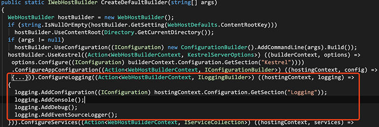

# 日志管理
   
ASP.NET Core 支持适用于各种内置和第三方日志记录提供程序的日志记录 API,并统一了日志操作接口`ILogger`,同时默认提供了基础日志的Provider。

## 1. 记录日志
```csharp
public class HomeController : Controller
{
    private ILogger _logger;
    public HomeController(ILogger<HomeController> logger)
    {
        _logger = logger;
    }

    public IActionResult Index()
    {
        _logger.LogDebug("日志记录测试内容");
        return View();
    }
}
```

在Asp.Net Core服务器构建之前的`CreateDefaultBuilder`中配置了默认的日志服务。我们可以在不做任何配置的情况下直接DI使用默认的日志服务,日志可以在控制台，VS调试窗口和事件查看器中查看到输出入的日志。



更详细的日志使用请参见[官方文档](https://docs.microsoft.com/zh-cn/aspnet/core/fundamentals/logging/?view=aspnetcore-2.2)

## 2. 第三方日志组件
Asp.Net Core默认的日志提供程序并没有提供写文件、数据库、邮件等功能，我们可以使用第三方日志提供程序完成,如[Nlog](https://nlog-project.org/)。

配置步骤非常简单，按[官方文档](https://github.com/NLog/NLog.Web/wiki/Getting-started-with-ASP.NET-Core-2)进行即可。

由于实现了统一的日志接口，替换不同的日志提供程序后，使用日志组件记录日志的代码无需修改，这也体现了面向接口多态编程的好处。

除了前面提到的日志组件，在大型分布式应用或微服务中就需要将分布式应用中分散各处的日志进行统一整理归类，这就需要分布式日志管理，如经典的日志组件 [ELK](https://colinchang.net/distribution/pages/log-elk.html)(跨平台)，.Net Core 日志组件 [Exceptionless](https://colinchang.net/distribution/pages/exceptionless.html)(依赖Windows平台)。
