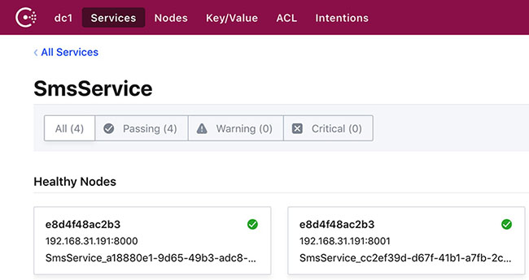

# Consul 服务治理

服务治理包括，服务注册、注销、健康检查、服务发现等过程。

微服务架构中，所有服务都会注册到注册中心，客户端需要消费服务时，需要先到注册中心查询对应服务集群，然后按照一定的负载均衡策略消费服务即可。注册中心除了提供服务注册，服务查询工作外，还会按照一定机制对所有注册的服务进行健康检查，以维护服务的可用性。

负载均衡策略在客户端，称为客户端负载均衡。当然也可以设置负载均衡服务器专门负责负载均衡任务。注册中心是在服务器机房环境，其消费者也是服务器机房环境内网的其他服务程序，不会对外网公开，所以这里说的客户端负载均衡中客户端消费程序是指服务器中的某个服务而非真正的用户端，所有客户端负载均衡也是但相对可靠的。

注册中心有很多实现，如Consul,Eureka、Zookeeper等。这里我们选择 [Consul](https://www.consul.io/)。

## 1. Consul 服务安装
这里我们直接通过Docker方式安装并部署Consul服务。
``` sh
# 此中配置仅用于开发。详细配置参见 https://hub.docker.com/_/consul

$ docker pull consul
$ docker run -d --name=consul-dev -e CONSUL_BIND_INTERFACE=eth0 -p 8500:8500 consul
```

这里只用一台Consul服务器做演示用，生产环境中为了保证注册中心可用性要做注册中心服务集群，至少一台 Server,多台 Agent。

Consul服务部署完成后直接通过 http://127.0.0.1:8500 即可访问其Web控制台。

## 2. 服务注册、注销、健康检查
连接 Consul 服务器需要借助 [Consul驱动](https://www.nuget.org/packages/Consul/)。

```sh
$ dotnet add package Consul
```

在.NET Core中微服务一般都体现为WebAPI项目，便于进行服务间通信。

生产环境中每个服务一般都会存在一个集群，互为备份，保证系统可用性。WebAPI项目默认启动监听 http://5000，单机启动多个服务实例时需要区别端口，我们可以在程序启动时动态指定端口。或者使用docker做端口映射。

#### 1) 服务启动设置

```csharp
public class Program
{
    public static void Main(string[] args)
    {
        /*
            * 程序启动时必须指定端口号，命令格式为 dotnet run --port 5000
            * 
            * 通过docker方式运行时要显式指定 ENTRYPOINT 参数。 形如 docker run xxx --port 5000
            */
        var config = new ConfigProvider(args);

        // 端口
        var portStr = config["port"];
        if (string.IsNullOrWhiteSpace(portStr))
            throw new ArgumentNullException("port", "Please choose a port for current service");
        if (!int.TryParse(args[1], out var port))
            throw new ArgumentException("porn must be a number");
        if (port < 1024 || port > 65535)
            throw new ArgumentOutOfRangeException("port", "Invalid port,it must between 1024 and 65535");

        // IP
        var bindHosts = ConfigProvider.GetAppSettings<List<string>>("BindHosts");
        var urls = bindHosts.Select(host => $"http://{host}:{port}").ToList();

        CreateWebHostBuilder(args, urls.ToArray()).Build().Run();
    }

    public static IWebHostBuilder CreateWebHostBuilder(string[] args, string[] urls) =>
        WebHost.CreateDefaultBuilder(args)
            .UseUrls(urls)
            .UseStartup<Startup>();
```

#### 2) appsettings.json
```json
{
  "BindHosts": [
    "192.168.31.191"
  ],
  "ConsulClient": {
    "Address": "http://127.0.0.1:8500",
    "Datacenter": "dc1"
  }
}
```

#### 3) 服务注册注销
```csharp
public async void Configure(IApplicationBuilder app, IHostingEnvironment env,
    IApplicationLifetime applicationLifetime)
{
    if (env.IsDevelopment())
    {
        app.UseDeveloperExceptionPage();
    }
    else
    {
        // The default HSTS value is 30 days. You may want to change this for production scenarios, see https://aka.ms/aspnetcore-hsts.
        app.UseHsts();
    }

    app.UseMvc();


    var serviceName = Assembly.GetEntryAssembly().GetName().Name;
    var serviceId = $"{serviceName}_{Guid.NewGuid()}";

    //Consul 配置
    void ConsulConfig(ConsulClientConfiguration ccc)
    {
        ccc.Address = new Uri(Configuration["ConsulClient:Address"]);
        ccc.Datacenter = Configuration["ConsulClient:Datacenter"];
    }

    //注册服务到Consul
    using (var client = new ConsulClient(ConsulConfig))
    {
        var hosts = new List<string>();
        Configuration.Bind("BindHosts", hosts);
        var ip = hosts.LastOrDefault();
        var port = Convert.ToInt32(Configuration["port"]);

        await client.Agent.ServiceRegister(new AgentServiceRegistration
        {
            ID = serviceId, //服务编号
            Name = serviceName, //服务名称
            Address = ip, //服务地址，一般绑定本机内网地址
            Port = port, // 服务端口
            Check = new AgentServiceCheck
            {
                DeregisterCriticalServiceAfter = TimeSpan.FromSeconds(5), // 服务停止多久后从Consul中注销
                Interval = TimeSpan.FromSeconds(10), //健康检查间隔(心跳时间)
                HTTP = $"http://{ip}:{port}/api/health", //健康检查地址
                Timeout = TimeSpan.FromSeconds(5) //检查超时时间
            }
        });
    }

    //程序退出时候 从Consul注销服务
    applicationLifetime.ApplicationStopped.Register(async () =>
    {
        using (var client = new ConsulClient(ConsulConfig))
        {
            await client.Agent.ServiceDeregister(serviceId);
        }
    });
}
```

启动两个服务实例后，在Consul中可以看到这个服务信息。
```sh
$ dotnet SmsService.dll --port 8000
$ dotnet SmsService.dll --port 8001
```



服务刚启动时会有短暂的 Failing 状态。服务正常结束(Ctrl+C)会触发 ApplicationStopped,正常注销。即使非正常结束也没关系,Consul 健康检查过一会发现服务器死掉后也会主动注销。如果服务器刚刚崩溃,但是还买来得及注销,消费的使用者可能就会拿到已经崩溃的实 例,这个问题通过后面讲的重试等策略解决。

服务只会注册 ip、端口,consul 只会保存服务名、ip、端口这些信息,至于服务提供什么接口、方法、参数,consul 不管,需要消费者知道服务的这些细节。

## 3. 服务发现
