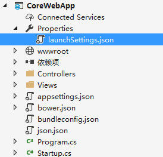
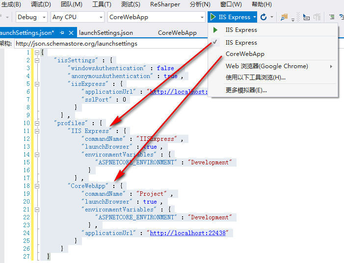

# ASP.NET Core 环境变量

* [1. 环境变量简介](#1-环境变量简介)
* [2. 设置环境变量](#2-设置环境变量)
    * [2.1 UseEnvironment](#21-useenvironment)
    * [2.2 launchSettings.json](#22-launchsettingsjson)
* [3. 使用环境变量](#3-使用环境变量)
    * [3.1 前端](#31-前端)
    * [3.2 后端](#32-后端)

## 1. 环境变量简介
Asp.Net Core的环境变量和启动设置，将开发过程中的调试和测试变的更加简单。我们只需要简单的修改配置文件，就可以实现开发、预演、生产环境的切换。

ASP.NET Core控制环境切换依赖于“ASPNETCORE_ENVIRONMENT”环境变量。此环境变量框架默认提供了三个值，当然我们也可以定义其它的值：
```
Development（开发）
Staging（预演）
Production（生产）
```

## 2. 设置环境变量
### 2.1 UseEnvironment
我们可以使用`IWebHostBuilder`的`UseEnvironment`方法来设定`ASPNETCORE_ENVIRONMENT`变量值。

```csharp
WebHost.CreateDefaultBuilder(args)
    .UseEnvironment(EnvironmentName.Production) //设置ASPNETCORE_ENVIRONMENT
    .UseStartup<Startup>();
```

### 2.2 launchSettings.json



ASP.Net Core包含一个launchSettings.json的文件,此文件是项目启动配置文件。我们可在其中配置`ASPNETCORE_ENVIRONMENT`环境变量。




## 3. 使用环境变量

环境变量检测在WebHost构建过程中注册为了`IHostingEnvironment`服务， 该类型的变量表示的是当前应用程序运行的环境，ASP.Net Core提供了四个扩展方法，用于检测 “ASPNETCORE_ENVIRONMENT”当前的值。

```csharp
IsDevelopment()                         //是否为开发环境
IsStaging()                             //是否为预演环境
IsProduction()                          //是否为生产环境
IsEnvironment(string environmentname)   //是否为某种环境
```

#### 3.1 前端
在Asp.Net Core视图中我们可以通过`environment`标签来使用环境变量。

```html
<environment include="Development">
    <link rel="stylesheet" href="~/css/site.css" />
</environment>
<environment exclude="Development">
    <link rel="stylesheet" href="~/css/site.min.css" />
</environment>
```

#### 3.2 后端

我们可以在任何需要根据环境控制应用程序行为的地方注入并使用`IHostingEnvironment`。比如默认的`Startup`的`Config`方法中根据是否为开发环境显示不同的错误展示方式。

```csharp
public void Configure(IApplicationBuilder app, IHostingEnvironment env)
{
    if (env.IsDevelopment())
    {
        app.UseDeveloperExceptionPage();
    }
    else
    {
        app.UseExceptionHandler("/Home/Error");
        // The default HSTS value is 30 days. You may want to change this for production scenarios, see https://aka.ms/aspnetcore-hsts.
        app.UseHsts();
    }

    // do something else ...
}
```

> IHostingEnvironment 常用成员

除了读取环境变量，IHostingEnvironment还有以下常用成员。

属性|含义
:-|:-
`ApplicationName`|当前程序名称
`ContentRootPath`|网站根目录(绝对路径)
`WebRootPath`|网站`wwwroot`目录(绝对路径)


参考文档：https://www.cnblogs.com/tdfblog/p/Environments-LaunchSettings-in-Asp-Net-Core.html