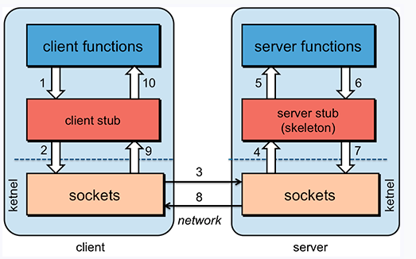
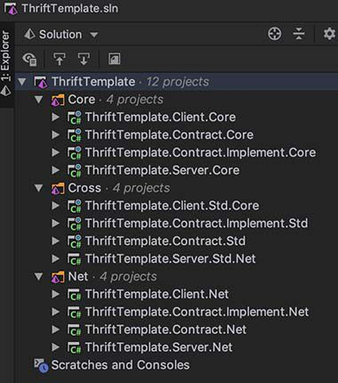

# RPC

* [1. RPC](#1-rpc)
* [2. Thrift](#2-thrift)
  * [2.1 简介](#21-简介)
  * [2.2 工作原理](#22-工作原理)
  * [2.3 .Net 使用](#23-net-使用)
* [3. 案例源码](#3-案例源码)

## 1. RPC
RPC(Remote Procedure Call Protocol) - 远程过程调用协议，是一种通过网络从远程计算机程序上请求服务，而不需要了解底层网络技术的协议。

单体程序中可以直接调用自身服务方法，但在分布式系统当中，如何实现服务调用呢，RPC技术简单说就是为了解决远程调用服务的一种技术，使得调用者像调用本地服务一样方便透明。



RPC可以采用HTTP协议，并且使用最为广泛，优点是开放、标准、简单、兼容性升级容易，缺点是性能略低。在 QPS 较高或者对响应时间要求苛刻的情况下,常采用二进制传输、如TCP通讯,更加高效也更加安全。也有部分公司采用私有协议，如腾讯的JCE协议。RPC 虽然效率略高,但是耦合性强,如果兼容性处理不好的话,一旦服务器端接口升级,客户端就要同步更新,没有HTTP灵活。

RPC在各大互联网公司中被广泛使用，如阿里巴巴的hsf、dubbo（开源）、Facebook的thrift（开源）、Google gRPC（开源）、Twitter的finagle（开源）等。

.Net Core中常用的RPC框架有 [gRPC](https://grpc.io/)、[Thrift](http://thrift.apache.org/) 等,
gRPC、Thrift 等都支持主流的编程语言。

性能方面：Thirft(大约 10 倍) > gRPC > Http。数据涞源于互联网,性能和业务数据的特点有关,仅供参考。<br/>
最佳实践：对内一些性能要求高的场合用 RPC,对内其他场合以及对外采用HTTP。

## 2. Thrift
### 2.1 简介
Thrift是一种接口描述语言和二进制通讯协议，是由Facebook为“大规模跨语言服务开发”而开发的。它通过一个代码生成引擎联合了一个软件栈，来创建不同程度的、无缝的跨平台高效服务，可以使用C#、C++（基于POSIX兼容系统）、Cappuccino、Cocoa、Delphi、Erlang、Go、Haskell、Java、Node.js、OCaml、Perl、PHP、Python、Ruby和Smalltalk。现在是Apache软件基金会的开源项目。

### 2.2 工作原理
Thrif通过模版文件定义服务接口规范，模版文件可以生成不同语言平台的代码文件，服务端和客户端分别引用生成的接口文件，服务端实现接口内容，并Host服务公开通讯地址，客户端连接服务端地址，并按照接口规范调用服务即可。

由于Thrif需要兼容大多数主流语言平台，所以接口文档不能采用所有语言各自书写一遍，于是Thrif推出 [IDL](http://thrift.apache.org/docs/idl)(interface definition language)来书写接口文档。IDL仅用于定义接口，包含常用的数据类型，语法比价简单，具体语法使用可以参阅 https://www.cnblogs.com/valor-xh/p/6386584.html

### 2.3 .Net 使用
下面我们以.Net Core为例简单演示一下Thrif的使用。Thrif 官方也提供了常用开发语言的案例，参见 https://github.com/colin-chang/thrift-official


#### 1) 定义模板
创建模板文件 UserService.thrift。模板文件扩展名通常为`.thrift`
```
namespace csharp ThriftDemo.Contract.Net
namespace netcore ThriftDemo.Contract.Core

service UserService 
{
  bool Create(1: Person person)
  bool Delete(1: i32 id)
  void Update(1: Person person)
  Person Query(1: i32 id)
}


struct Person
{
  1: i32 id
  2: string name
  3: i32 age
}
```

#### 2) 生成接口文档
Thrift提供了不同平台的模板生成程序Windows下是一个可执行程序使用比较简单，但在mac OS和Linux下使用生成器则需要安装复杂的运行环境，但是Docker让一切变得无比简单，这里给出Docker生成器使用命令。

```sh
# .NET sync
docker run --rm -v "$PWD:/data" thrift thrift -o /data --gen csharp /data/UserService.thrift

# .Net Core async
docker run --rm -v "$PWD:/data" thrift thrift -o /data --gen netcore /data/UserService.thrift
```

目前 Thrift v0.13.0 为.Net Core提供了TPL风格代码，支持异步，但遗憾的是.Net Framework只有同步版本,两者代码实现也略有不同。

#### 3) 创建接口项目
* 创建.Net Standard类库项目`ThriftTemplate.Contract`作为接口项目。
* 将上一步生成的接口文件拷贝到当前项目中。
* 引用 [ApacheThrift](https://www.nuget.org/packages/ApacheThrift/) nuget包到项目中

#### 4) 服务端
##### 1. 接口实现
* 创建类库项目`ThriftTemplate.Contract.Implement`
* 添加`ThriftTemplate.Contract`接口项目引用
* 实现接口。参考代码如下。
  ```csharp
  public class UserSvs : UserService.IAsync
  {
      public Task<bool> CreateAsync(Person person, CancellationToken cancellationToken)
      {
          // your code
          return Task.FromResult(true);
      }

      public Task<bool> DeleteAsync(int id, CancellationToken cancellationToken)
      {
          // your code
          return Task.FromResult(true);
      }

      public Task UpdateAsync(Person person, CancellationToken cancellationToken)
      {
          // your code
          return Task.CompletedTask;
      }

      public Task<Person> QueryAsync(int id, CancellationToken cancellationToken)
      {
          // your code
          return Task.FromResult(new Person {Id = 0, Name = "Colin", Age = 18});
      }
  }
  ```

##### 2. 运行服务
* 创建服务宿主控制台项目`ThriftTemplate.Server`。
* 管理项目引用
  * 引用Nuget 
    * [ApacheThrift](https://www.nuget.org/packages/ApacheThrift/)
    * [Microsoft.Extensions.Logging](https://www.nuget.org/packages/Microsoft.Extensions.Logging)
  * 添加项目引用
    * 接口项目`ThriftTemplate.Contract`
    * 接口实现项目`ThriftTemplate.Contract.Implement`
* 启动服务到指定地址。参考代码如下。

  ```csharp
  var serviceProvider = new ServiceCollection()
    .AddSingleton<UserService.IAsync>(new UserSvs())
    .AddLogging(logging => logging.SetMinimumLevel(LogLevel.Trace))
    .BuildServiceProvider();

  using (var source = new CancellationTokenSource())
  {
      var server = new AsyncBaseServer(
          new AsyncProcessor(serviceProvider.GetService<UserService.IAsync>()),
          new TServerSocketTransport(10010),//监听端口
          new TBinaryProtocol.Factory(),
          new TBinaryProtocol.Factory(),
          serviceProvider.GetService<ILoggerFactory>()
      );

      await server.ServeAsync(source.Token);
  }
  ```

#### 5) 客户端
* 创建客户端控制台项目`ThriftTemplate.Client`
* 添加`ThriftTemplate.Contract`接口项目引用。引用 [ApacheThrift](https://www.nuget.org/packages/ApacheThrift/)
* 调用远程服务。参考代码如下。
  ```csharp
  //创建服务连接
  using (var transport = new TSocketClientTransport(IPAddress.Parse("127.0.0.1"), 10010))
  {
      using (var protocol = new TBinaryProtocol(transport))
      {
          using (var client = new UserService.Client(protocol))
          {
              using (var source = new CancellationTokenSource())
              {
                  await client.OpenTransportAsync(source.Token);
                  await client.QueryAsync(0, source.Token);//调用服务方法
              }
          }
      }
  }
  ```

#### 6) 项目优化
以上我们可以发现，客户端调用每个服务端方法都需写类似调用代码较繁琐且重复，于是我们考虑将封装扩展对服务端方法调用，我们发现Thrift生成的接口文件中，接口的所在类都是partial class就是为了方便开发者自行扩展且避免重新生成后造成代码覆盖丢失。

每个接口方法都需要提供一个帮助扩展方法，于是我们可以考虑直接实现服务接口，同时为了方便使用我们也可以将服务运行代码进行封装。

我们在接口项目`ThriftTemplate.Contract`中新建`UserServiceExtension.cs`并对服务接口调用做如下扩展。
```csharp
public partial class UserService : UserService.IAsync
{
    // 服务端
    public static async Task RunAsync(IAsync processor, int port, ILoggerFactory loggerFactory)
    {
        using (var source = new CancellationTokenSource())
        {
            var server = new AsyncBaseServer(
                new AsyncProcessor(processor),
                new TServerSocketTransport(port),
                new TBinaryProtocol.Factory(),
                new TBinaryProtocol.Factory(),
                loggerFactory
            );

            await server.ServeAsync(source.Token);
        }
    }

    private readonly IPAddress _host;
    private readonly int _port;

    public UserService(IPAddress host, int port)
    {
        _host = host;
        _port = port;
    }

    //以下为客户端扩展

    public async Task<bool> CreateAsync(Person person)
    {
        using (var source = new CancellationTokenSource())
            return await CreateAsync(person, source.Token);
    }

    public async Task<bool> CreateAsync(Person person, CancellationToken cancellationToken) =>
        await InvokeAsync(async client => await client.CreateAsync(person, cancellationToken),
            cancellationToken);


    public async Task<bool> DeleteAsync(int id)
    {
        using (var source = new CancellationTokenSource())
            return await DeleteAsync(id, source.Token);
    }

    public async Task<bool> DeleteAsync(int id, CancellationToken cancellationToken) =>
        await InvokeAsync(async client => await client.DeleteAsync(id, cancellationToken), cancellationToken);


    public async Task UpdateAsync(Person person)
    {
        using (var source = new CancellationTokenSource())
            await UpdateAsync(person, source.Token);
    }

    public async Task UpdateAsync(Person person, CancellationToken cancellationToken) =>
        await InvokeAsync(async client => await client.UpdateAsync(person, cancellationToken), cancellationToken);


    public async Task<Person> QueryAsync(int id)
    {
        using (var source = new CancellationTokenSource())
            return await QueryAsync(id, source.Token);
    }

    public async Task<Person> QueryAsync(int id, CancellationToken cancellationToken) =>
        await InvokeAsync(async client => await client.QueryAsync(id, cancellationToken), cancellationToken);


    private async Task InvokeAsync(Action<Client> action, CancellationToken cancellationToken)
    {
        using (var transport = new TSocketClientTransport(_host, _port))
        {
            using (var protocol = new TBinaryProtocol(transport))
            {
                using (var client = new Client(protocol))
                {
                    await client.OpenTransportAsync(cancellationToken);
                    action(client);
                }
            }
        }
    }

    private async Task<T> InvokeAsync<T>(Func<Client, Task<T>> action, CancellationToken cancellationToken)
    {
        using (var transport = new TSocketClientTransport(_host, _port))
        {
            using (var protocol = new TBinaryProtocol(transport))
            {
                using (var client = new Client(protocol))
                {
                    await client.OpenTransportAsync(cancellationToken);
                    return await action(client);
                }
            }
        }
    }
}
```

使用以上扩展后，服务端和客户端代码可以大大简化。
```csharp
//服务端
var serviceProvider = new ServiceCollection()
    .AddSingleton<UserService.IAsync>(new UserSvs())
    .AddLogging(logging => logging.SetMinimumLevel(LogLevel.Trace))
    .BuildServiceProvider();
await UserService.RunAsync(serviceProvider.GetService<UserService.IAsync>(), 10010, serviceProvider.GetService<ILoggerFactory>());

//客户端
var service = new UserService(IPAddress.Parse("127.0.0.1"), 10010);
await service.QueryAsync(0);
await Service.DeleteAsync(0);
```

#### 7) .Net Framework与.Net Core
[ApacheThrift](https://www.nuget.org/packages/ApacheThrift/)是Apach官方提供的Provider，可以兼容.Net Core和.Net Framework，它为.Net Core和.Net Framework提供了不同的dll，所以也导致使用此package的.Net Core和.Net Framework项目不可互通，如，不能使用一个 .net core客户端调用.net framework服务端。

如果需要实现.Net Framework和.Net Core的Thrift互通可以是使用第三方nuget包，如[apache-thrift-netcore](https://www.nuget.org/packages/apache-thrift-netcore/)，它可以兼容所有.net实现。

## 3. 案例源码



Core目录下是.Net Core版本实现。
Net目录下是.Net Framework版本实现。
Cross目录下是.Net Core与.Net Framework混用版本

项目案例下载：https://github.com/colin-chang/ThriftTemplate

> 参考文档

* https://www.cnblogs.com/focus-lei/p/8889389.html
* http://doc.oschina.net/grpc?t=58008