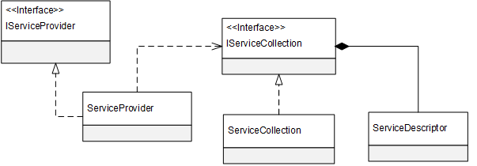

# 服务注册与提供

* [1. ServiceProvider与ServiceDescriptor](#1-serviceprovider与servicedescriptor)
* [2. 服务注册与提供](#2-服务注册与提供)
    * [2.1 ServiceProvider提供服务](#21-serviceprovider提供服务)
    * [2.2 服务实例集合](#22-服务实例集合)
    * [2.3 ServiceProvider自身对象](#23-serviceprovider自身对象)
    * [2.4 泛型支持](#24-泛型支持)

在采用了依赖注入的应用中，我们总是直接利用DI容器直接获取所需的服务实例，换句话说，DI容器起到了一个服务提供者的角色，它能够根据我们提供的服务描述信息提供一个可用的服务对象。ASP.NET Core中的DI容器体现为一个实现了IServiceProvider接口的对象。

## 1. ServiceProvider与ServiceDescriptor
作为一个服务的提供者，ASP.NET Core中的DI容器最终体现为一个IServiceProvider接口，我们将所有实现了该接口的类型及其实例统称为ServiceProvider。如下面的代码片段所示，该接口简单至极，它仅仅提供了唯一个GetService方法，该方法根据提供的服务类型为你提供对应的服务实例。

```csharp
public interface IServiceProvider
{
    object GetService(Type serviceType);
}
```

ASP.NET Core内部真正使用的是一个实现了IServiceProvider接口的内部类型（该类型的名称为“ServiceProvider”），我们不能直接创建该对象，只能间接地通过调用IServiceCollection接口的扩展方法BuildServiceProvider得到它。IServiceCollection接口定义在“Microsoft.Extensions.DependencyInjection”命名空间下，如果没有特别说明，本系列文章涉及到的与ASP.NET Core依赖注入相关的类型均采用此命名空间。 如下面的代码片段所示，IServiceCollection接口实际上代表一个元素为ServiceDescriptor对象的集合，它直接继承了另一个接口IList<ServiceDescriptor>，而ServiceCollection类实现了该接口。

```csharp
public static class ServiceCollectionExtensions
{
    public static IServiceProvider BuildServiceProvider(this rviceCollection services);
}
 
public interface IServiceCollection : IList<ServiceDescriptor>
{}
 
Public class ServiceCollection: IServiceCollection
{
    //省略成员
}
```

体现为DI容器的ServiceProvider之所以能够根据我们给定的服务类型（一般是一个接口类型）提供一个能够开箱即用的服务实例，是因为我们预先注册了相应的服务描述信息，这些指导ServiceProvider正确实施服务提供操作的服务描述体现为如下一个ServiceDescriptor类型。

```csharp
public class ServiceDescriptor
{
    public ServiceDescriptor(Type serviceType, object instance);
    public ServiceDescriptor(Type serviceType, Func<IServiceProvider, object> factory, ServiceLifetime lifetime);
    public ServiceDescriptor(Type serviceType, Type implementationType, ServiceLifetime lifetime);
 
    public Type ServiceType {  get; }
    public ServiceLifetime Lifetime {  get; }
 
    public Type ImplementationType {  get; }
    public object ImplementationInstance {  get; }
    public Func<IServiceProvider, object> ImplementationFactory {  get; }      
}
```

ServiceDescriptor的ServiceType属性代表提供服务的类型，由于标准化的服务一般会定义成接口，所以在绝大部分情况下体现为一个接口类型。类型为ServiceLifetime的属性Lifetime体现了ServiceProvider针对服务实例生命周期的控制方式。如下面的代码片段所示，ServiceLifetime是一个枚举类型，定义其中的三个选项（Singleton、Scoped和Transient）体现三种对服务对象生命周期的控制形式，我们将在本节后续部分对此作专门的介绍。

```csharp
public enum ServiceLifetime
{
    Singleton,
    Scoped,
    Transient
}
```

对于ServiceDescriptor的其他三个属性来说，它们实际上是辅助ServiceProvider完成具体的服务实例提供操。ImplementationType属性代表被提供服务实例的真实类型，属性ImplementationInstance则直接代表被提供的服务实例，ImplementationFactory则提供了一个创建服务实例的委托对象。ASP.NET Core与依赖注入相关的几个核心类型具有如下图所示的关系。



由于ASP.NET Core中的ServiceProvider是根据一个代表ServiceDescriptor集合的IServiceCollection对象创建的，当我们调用其GetService方法的时候，它会根据我们提供的服务类型找到对应的ServiceDecriptor对象。如果该ServiceDecriptor对象的ImplementationInstance属性返回一个具体的对象，该对象将直接用作被提供的服务实例。如果ServiceDecriptor对象的ImplementationFactory返回一个具体的委托，该委托对象将直接用作创建服务实例的工厂。如果这两个属性均为Null，ServiceProvider才会根据ImplementationType属性返回的类型调用相应的构造函数创建被提供的服务实例。至于我们在上面一节中提到的三种依赖注入方式，**ServiceProvider仅仅支持构造器注入，属性注入和方法注入的支持并未提供。**

## 2. 服务注册与提供
ASP.NET Core针对依赖注入的编程主要体现在两个方面：
* 创建一个ServiceCollection对象并将服务注册信息以ServiceDescriptor对象的形式添加其中；
* 针对ServiceCollection对象创建对应的ServiceProvider并利用它提供我们需要的服务实例。

在进行服务注册的时候，我们可以直接调用相应的构造函数创建ServiceDescriptor对象并将其添加到ServiceCollection对象之中。除此之外，IServiceCollection接口还具有如下三组扩展方法将这两个步骤合二为一。从下面给出的代码片段我们不难看出这三组扩展方法分别针对上面我们提及的三种针对服务实例的生命周期控制方式，泛型参数TService代表服务的声明类型，即ServiceDescriptor的ServiceType属性，至于ServiceDescriptor的其他属性，则通过方法相应的参数来提供。

```csharp
public static class ServiceCollectionExtensions
{
    public static IServiceCollection AddScoped<TService>(this IServiceCollection services) where TService: class;
   //其他AddScoped<TService>重载
 
    public static IServiceCollection AddSingleton<TService>(this IServiceCollection services) where TService: class;
   //其他AddSingleton<TService>重载
 
    public static IServiceCollection AddTransient<TService>(this IServiceCollection services) where TService: class;
    //其他AddTransient<TService>重载
}
```

对于用作DI容器的ServiceProvider对象来说，我们可以直接调用它的GetService方法根据指定的服务类型获得想用的服务实例。除此之外，服务的提供还可以通过IServiceProvider接口相应的扩展方法来完成。如下面的代码片段所示，扩展方法GetService<T>以泛型参数的形式指定服务的声明类型。至于另外两个扩展方法GetRequiredService和GetRequiredService<T>，如果ServiceProvider不能提供一个具体的服务实例，一个InvalidOperationException异常会被抛出来并提示相应的服务注册信息不足。

```csharp
public static class ServiceProviderExtensions
{ 
    public static T GetService<T>(this IServiceProvider provider);
    public static object GetRequiredService(this IServiceProvider provider, Type serviceType);
    public static T GetRequiredService<T>(this IServiceProvider provider);
}
```

### 2.1 ServiceProvider提供服务
接下来采用实例演示的方式来介绍如何利用ServiceCollection进行服务注册，以及如何利用ServiceCollection创建对应的ServiceProvider来提供我们需要的服务实例。

定义四个服务接口（IFoo、IBar、IBaz和IGux）以及分别实现它们的四个服务类（Foo、Bar、Baz和Gux）如下面的代码片段所示，IGux具有三个只读属性（Foo、Bar和Baz）均为接口类型，并在构造函数中进行初始化。

```csharp
public interface IFoo {}
public interface IBar {}
public interface IBaz {}
public interface IGux
{
    IFoo Foo { get; }
    IBar Bar { get; }
    IBaz Baz { get; }
}
 
public class Foo : IFoo {}
public class Bar : IBar {}
public class Baz : IBaz {}
public class Gux : IGux
{
    public IFoo Foo { get; private set; }
    public IBar Bar { get; private set; }
    public IBaz Baz { get; private set; }
 
    public Gux(IFoo foo, IBar bar, IBaz baz)
    {
        this.Foo = foo;
        this.Bar = bar;
        this.Baz = baz;
    }
}   
```

现在我们在作为程序入口的Main方法中创建了一个ServiceCollection对象，并采用不同的方式完成了针对四个服务接口的注册。具体来说，对于服务接口IFoo和IGux的ServiceDescriptor来说，我们指定了代表服务真实类型的ImplementationType属性，而对于针对服务接口IBar和IBaz的ServiceDescriptor来说，我们初始化的则是分别代表服务实例和服务工厂的ImplementationInstance和ImplementationFactory属性。由于我们调用的是AddSingleton方法，所以四个ServiceDescriptor的Lifetime属性均为Singleton。

```csharp
class Program
{
    static void Main(string[] args)
    {
        IServiceCollection services = new ServiceCollection()
            .AddSingleton<IFoo, Foo>()
            .AddSingleton<IBar>(new Bar())
            .AddSingleton<IBaz>(_ => new Baz())
            .AddSingleton<IGux, Gux>();
 
        IServiceProvider serviceProvider = services.BuildServiceProvider();
        Console.WriteLine("serviceProvider.GetService<IFoo>(): {0}",serviceProvider.GetService<IFoo>());
        Console.WriteLine("serviceProvider.GetService<IBar>(): {0}", serviceProvider.GetService<IBar>());
        Console.WriteLine("serviceProvider.GetService<IBaz>(): {0}", serviceProvider.GetService<IBaz>());
        Console.WriteLine("serviceProvider.GetService<IGux>(): {0}", serviceProvider.GetService<IGux>());
    }
}
```

接下来我们调用ServiceCollection对象的扩展方法BuildServiceProvider得到对应的ServiceProvider对象，然后调用其扩展方法GetService<T>分别获得针对四个接口的服务实例对象并将类型名称其输出到控制台上。运行该程序之后，我们会在控制台上得到如下的输出结果，由此印证ServiceProvider为我们提供了我们期望的服务实例。

```csharp
serviceProvider.GetService<IFoo>(): Foo
serviceProvider.GetService<IBar>(): Bar
serviceProvider.GetService<IBaz>(): Baz
serviceProvider.GetService<IGux>(): Gux
```

### 2.2 服务实例集合
如果我们在调用GetService方法的时候将服务类型指定为IEnumerable<T>，那么返回的结果将会是一个集合对象。除此之外， 我们可以直接调用IServiceProvider如下两个扩展方法GetServeces达到相同的目的。在这种情况下，ServiceProvider将会利用所有与指定服务类型相匹配的ServiceDescriptor来提供具体的服务实例，这些均会作为返回的集合对象的元素。如果所有的ServiceDescriptor均与指定的服务类型不匹配，那么最终返回的是一个空的集合对象。

```csharp
public static class ServiceProviderExtensions
{
    public static IEnumerable<T> GetServices<T>(this IServiceProvider provider);
    public static IEnumerable<object> GetServices(this IServiceProvider provider, Type serviceType);
}
```

值得一提的是，如果ServiceProvider所在的ServiceCollection包含多个具有相同服务类型（对应ServiceType属性）的ServiceDescriptor，当我们**调用GetService方法获取单个服务实例的时候，只有最后一个ServiceDescriptor才是有效的，至于其他的ServiceDescriptor，它们只有在获取服务集合的场景下才有意义。**

我们通过一个简单的实例来演示如何利用ServiceProvider得到一个包含多个服务实例的集合。我们在一个控制台应用中定义了如下一个服务接口IFoobar，两个服务类型Foo和Bar均实现了这个接口。在作为程序入口的Main方法中，我们将针针对服务类型Foo和Bar的两个ServiceDescriptor添加到创建的ServiceCollection对象中，这两个ServiceDescriptor对象的ServiceType属性均为IFoobar。

```csharp
class Program
{
    static void Main(string[] args)
    {
        IServiceCollection serviceCollection = new ServiceCollection()
             .AddSingleton<IFoobar, Foo>()
             .AddSingleton<IFoobar, Bar>();
 
        IServiceProvider serviceProvider = serviceCollection.BuildServiceProvider();
        Console.WriteLine("serviceProvider.GetService<IFoobar>(): {0}", serviceProvider.GetService<IFoobar>());
 
        IEnumerable<IFoobar> services = serviceProvider.GetServices<IFoobar>();
        int index = 1;
        Console.WriteLine("serviceProvider.GetServices<IFoobar>():");
        foreach (IFoobar foobar in services)
        {
            Console.WriteLine("{0}: {1}", index++, foobar);
        }
    }
}
 
public interface IFoobar {}
public class Foo : IFoobar {}
public class Bar : IFoobar {}
```

在调用ServiceCollection对象的扩展方法BuildServiceProvider得到对应的ServiceProvider对象之后，我们先调用其GetService<T>方法以确定针对服务接口IFoobar得到的服务实例的真实类型就是是Foo还是Bar。接下来我们调用ServiceProvider的扩展方法GetServices<T>获取一组针对服务接口IFoobar的服务实例并将它们的真是类型打印在控制台上。该程序运行后将会在控制台上生成如下的输出结果。

```
serviceProvider.GetService<IFoobar>(): Bar
serviceProvider.GetServices<IFoobar>():
Foo
Bar
```

### 2.3 ServiceProvider自身对象
对于ServiceProvider的服务提供机制来说，还有一个小小的细节值得我们关注，那就是当我们调用GetService或者GetRequiredService方法的时候若将服务类型设定为IServiceProvider，那么得到的对象实际上就是ServiceProvider自身这个对象。与之同理，调用GetServices方法将会返回一个包含自身的集合。如下所示的代码片段体现了ServiceProvider的这个特性。

```csharp
class Program
{
    static void Main(string[] args)
    {
        IServiceProvider serviceProvider = new ServiceCollection().BuildServiceProvider();
        Debug.Assert(object.ReferenceEquals(serviceProvider, serviceProvider.GetService<IServiceProvider>()));
        Debug.Assert(object.ReferenceEquals(serviceProvider, serviceProvider.GetServices<IServiceProvider>().Single()));
    }
}
```

### 2.4 泛型支持
ServiceProvider提供的服务实例不仅限于普通的类型，它对泛型服务类型同样支持。在针对泛型服务进行注册的时候，我们可以将服务类型设定为携带具体泛型参数的“关闭泛型类型”（比如IFoobar&lt;IFoo,IBar&gt;），除此之外服务类型也可以是包含具体泛型参数的“开放泛型类型”（比如IFoo&lt;,&gt;）。前者实际上还是将其视为非泛型服务来对待，后者才真正体现了“泛型”的本质。

比如我们注册了某个泛型服务接口IFoobar&lt;,&gt;与它的实现类Foobar&lt;,&gt;之间的映射关系，当我们指定一个携带具体泛型参数的服务接口类型IFoobar&lt;IFoo,IBar&gt;并调用ServiceProvider的GetService方法获取对应的服务实例时，ServiceProvider会针对指定的泛型参数类型(IFoo和IBar)来解析与之匹配的实现类型（可能是Foo和Baz）并得到最终的实现类型（Foobar&lt;Foo,Baz&gt;）。

我们同样利用一个简单的控制台应用来演示基于泛型的服务注册与提供方式。如下面的代码片段所示，我们定义了三个服务接口（IFoo、IBar和IFoobar&lt;T1,T2&gt;）和实现它们的三个服务类（Foo、Bar个Foobar&lt;T1,T2&gt;）,泛型接口具有两个泛型参数类型的属性（Foo和Bar），它们在实现类中以构造器注入的方式被初始化。

```csharp
class Program
{
    static void Main(string[] args)
    {
        IServiceProvider serviceProvider = new ServiceCollection()
            .AddTransient<IFoo, Foo>()
            .AddTransient<IBar, Bar>()
            .AddTransient(typeof(IFoobar<,>), typeof(Foobar<,>))
            .BuildServiceProvider();
 
        Console.WriteLine("serviceProvider.GetService<IFoobar<IFoo, IBar>>().Foo: {0}", serviceProvider.GetService<IFoobar<IFoo, IBar>>().Foo);
        Console.WriteLine("serviceProvider.GetService<IFoobar<IFoo, IBar>>().Bar: {0}", serviceProvider.GetService<IFoobar<IFoo, IBar>>().Bar);
    }
}
 
public interface IFoobar<T1, T2>
{
    T1 Foo { get; }
    T2 Bar { get; }
}
public interface IFoo {}
public interface IBar {}
 
public class Foobar<T1, T2> : IFoobar<T1, T2>
{
    public T1 Foo { get; private set; }
    public T2 Bar { get; private set; }
    public Foobar(T1 foo, T2 bar)
    {
        this.Foo = foo;
        this.Bar = bar;
    }
}
public class Foo : IFoo {}
public class Bar : IBar {}
```

在作为入口程序的Main方法中，我们创建了一个ServiceCollection对象并采用Transient模式注册了上述三个服务接口与对应实现类型之间的映射关系，对于泛型服务IFoobar&lt;T1,T2&gt;/Foobar&lt;T1,T2&gt;来说，我们指定的是不携带具体泛型参数的开放泛型类型IFoobar&lt;,&gt;/Foobar&lt;,&gt;。利用此ServiceCollection创建出对应的ServiceProvider之后，我们调用后者的GetService方法并指定IFoobar&lt;IFoo,IBar&gt;为服务类型。得到的服务对象将会是一个Foobar&lt;Foo,Bar&gt;对象，我们将它的Foo和Bar属性类型输出于控制台上作为验证。该程序执行之后将会在控制台上产生下所示的输出结果。

```
serviceProvider.GetService<IFoobar<IFoo, IBar>>().Foo: Foo 
serviceProvider.GetService<IFoobar<IFoo, IBar>>().Bar: Bar 
```

> 参考文献
http://www.cnblogs.com/artech/p/asp-net-core-di-register.html