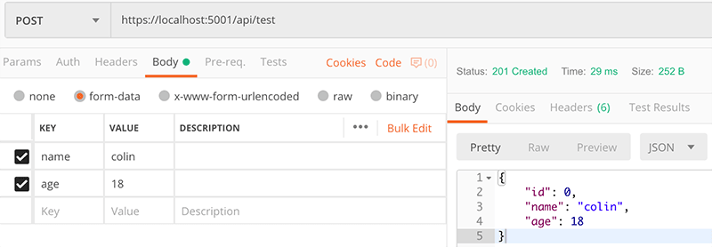
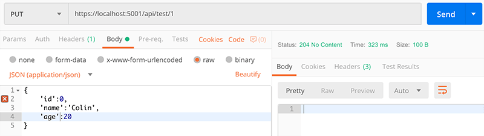

# WebAPI 基础
* [1. ApiController](#1-apicontroller)
* [2. 路由匹配](#2-路由匹配)
    * [2.1 RouteAttribute 和 HttpMethodAttribute](#21-routeattribute-和-httpmethodattribute)
    * [2.2 Restful 路由](#22-restful-路由)
    * [2.3 自定义路由](#23-自定义路由)
        * [2.3.1 Restful 之殇](#231-restful-之殇)
        * [2.3.2 自定义Action路由](#232--自定义action路由)
        * [2.3.3 回归MVC路由](#233-回归mvc路由)
* [3. API参数](#3-api参数)
    * [3.1 URL参数](#31-url参数)
    * [3.2 对象参数](#32-对象参数)
* [4. 返回值](#4-返回值)
* [5. 异常处理](#5-异常处理)
    * [5.1 业务性错误](#51-业务性错误)
    * [5.2 常规异常处理](#52-常规异常处理)
    * [5.3 全局异常过滤器](#53-全局异常过滤器)

## 1. ApiController
* WebAPI中`Controller`直接即继承自`ControllerBase`。在ASP.NET Core 2.1之后引入`[ApiController]`用于批注 Web API 控制器类。`[ApiController]`特性通常结合`ControllerBase`来为控制器启用特定 REST 行为。

    ```csharp
    [Route("api/[controller]")]
    [ApiController]
    public class ProductsController : ControllerBase
    ```

* 在 ASP.NET Core 2.2 或更高版本中，可将`[ApiController]`特性应用于程序集。以这种方式进行注释，会将 web API 行为应用到程序集中的所有控制器。 建议将程序集级别的特性应用于 Startup 类。
    ```csharp
    [assembly: ApiController]
    namespace WebApiSample.Api._22
    {
        public class Startup
        {
        }
    ```

## 2. 路由匹配
### 2.1 RouteAttribute 和 HttpMethodAttribute
WebAPI中必须为每个`Controller`使用`[Route]`特性进行路由设定，而不能通过`UseMvc`中定义的传统路由或通过`Startup.Configure`中的`UseMvcWithDefaultRoute`配置路由。

与`Controller`设定路由方式一样，我们也可以在`Action`方法上使用`[Route]`单独设定路由，除了`[Route]`，我们也可以使用`HttpMethodAttribute`设定路由，用法相同，`HttpMethodAttribute`包括`[HttpGet]`、`[HttpPost]`、`[HttpPut]`、`[HttpDelete]`等。`Action`路由建立在`Controller`路由之上。

使用`HttpMethodAttribute`定义路由时会同时限制`Action`方法的`HTTP`访问方式，如果单纯想为`Action`方法设定路由同时允许多种HTTP访问方式，可以是使用`[Route]`配置路由。

路由不区分大小写。

```csharp
[Route("api/test")]
public class TestController : ControllerBase
{
    // GET api/test
    [HttpGet]
    public ActionResult<string> Get()
    {
        return nameof(Get);
    }

    //GET api/test/1
    [HttpGet("{id}")]
    public ActionResult<string> Get(int id)
    {
        return nameof(Get) + id;
    }

    //GET api/test/getbyname/colin
    [HttpGet("GetByName/{name?}")]
    public ActionResult<string> Get(string name)
    {
        return "GetByName" + name;
    }

    //GET api/test/colin/18
    [HttpGet("{name}/{age}")]
    public ActionResult<string> Get(string name,int age)
    {
        return nameof(Get) + name + age;
    }
}
```

### 2.2 Restful 路由
WebAPI默认路由使用`Restful`风格,按照请求方式进行路由，不作标记的情况下，`Action`方法名会按照请求方式进行`StartWith`匹配。所以的`Get()`、`GetById()`、`GetXXX()`没有任何区别。如果使用`[HttpGet]`标记了`Action`方法，则方法名任意取，不必以`GET`开头。同理，`POST`、`PUT`、`DELETE`亦是如此。


### 2.3 自定义路由
#### 2.3.1 Restful 之殇
完全符合`Restful`风格的API在很多业务常见下并不能满足需求。如之前所说，把所有业务抽象为CRUD操作并不现实，简单通过HTTP状态码也不容易区分处理结果。除此之外，仅通过简单几种谓词语意进行路由在难以满足复杂业务需求。如，根据ID查询用户、根据用户名查询用户、根据手机号查询用户。
```csharp
// 错误方式，调用报错
[Route("api/test")]
public class TestController : ControllerBase
{
    [HttpGet("{id}")]
    public ActionResult<User> GetById(int id)
    {
        return Users.FirstOrDefault(u=>u.Id==id);
    }

    [HttpGet("{userName}")]
    public ActionResult<User> GetByUserName(string userName)
    {
        return Users.FirstOrDefault(u=>u.UserName==userName);
    }

    [HttpGet("{phoneNumber}")]
    public ActionResult<User> GetByPhoneNumber(string phoneNumber)
    {
        return Users.FirstOrDefault(u=>u.PhoneNumber==phoneNumber);
    }
}
```
以上代码可以编译通过，但由于三个`Action`匹配相同路由规则，所以`GET`请求`~/api/test/xxx` 时会出现歧义而抛出`AmbiguousMatchException`。

#### 2.3.2  自定义Action路由
此时我们可以通过前面提到的[`RouteAttribute`或`HttpMethodAttribute`](#21-routeattribute-和-httpmethodattribute)来为每个`Action`设置特定路由。
```csharp
// 自定义Action路由
[Route("api/test")]
public class TestController : ControllerBase
{
    //GET api/test/getbyid/1
    [HttpGet("GetById/{id}")]
    public ActionResult<User> GetById(int id)
    {
        return Users.FirstOrDefault(u=>u.Id==id);
    }
    
    //GET api/test/getbyusername/colin
    [HttpGet("GetByUserName/{userName}")]
    public ActionResult<User> GetByUserName(string userName)
    {
        return Users.FirstOrDefault(u=>u.UserName==userName);
    }

    //GET api/test/getbyphonenumber/110
    [HttpGet("GetByPhoneNumber/{phoneNumber}")]
    public ActionResult<User> GetByPhoneNumber(string phoneNumber)
    {
        return Users.FirstOrDefault(u=>u.PhoneNumber==phoneNumber);
    }
}
```

#### 2.3.3 回归MVC路由
以上为每个`Action`单独配置路由后解决了`Restful`遇到的问题。不难发现当每个`Action`方法路由名称恰好是自身方法名时，我们便可以通过`Action`名称来访问对应接口，这与`MVC`路由方式效果一致。

单独为每个`Action`方法都配置路由较为繁琐，我们可以仿照`MVC`路由方式直接配置Controller路由，路由效果一致，但使用跟简单。

```csharp
// 自定义Controller路由

[Route("api/test/{Action}")]
public class TestController : ControllerBase
{
    //GET api/test/getbyid/1
    [HttpGet("{id?}")]
    public ActionResult<User> GetById(int id)
    {
        return Users.FirstOrDefault(u=>u.Id==id);
    }

    //GET/POST/PUT/DELETE api/test/getbyusername/colin
    [Route("{userName}")]
    public ActionResult<User> GetByUserName(string userName)
    {
        return Users.FirstOrDefault(u=>u.UserName==userName);
    }

    //GET api/test/getbyphonenumber?phoneNumber=110
    [HttpGet]
    public ActionResult<User> GetByPhoneNumber(string phoneNumber)
    {
        return Users.FirstOrDefault(u=>u.PhoneNumber==phoneNumber);
    }
}
```
`Restful`风格路由与MVC路由只是匹配`Action`方法方式不同，MVC路由通过`Action`方法名定位要比`Restful`通过谓词语意定位更加多变，更容易应付复杂的业务场景。

## 3. API参数
`GET`、`POST`、`PUT`、`DELETE`等所有请求方式均可使用 URL参数 和 对象参数 进行参数传递。

`GET`和`DELETE`请求通常传递数据量较少，多使用URL参数。`POST`和`PUT`请求通常传递数量较大，多使用对象参数。

### 3.1 URL参数
简单参数有两种，QueryString参数和路由参数，这两种都参数以不同形式体现在URL中，所以我们统称为URL参数。

在参数少且简单对安全性要求不高的情况下，可以使用URL参数。

```csharp
[Route("api/test")]
public class TestController : ControllerBase
{
    //GET api/test?name=colin&age=18
    [HttpGet]
    public ActionResult<string> Get(string name, int age)
    {
        return name + age;
    }

    //DELETE api/test/1
    [HttpDelete("{id}")]
    public ActionResult Delete(int id)
    {
        return NoContent();
    }
}
```

### 3.2 对象参数
参数内容多且复杂或安全性较高的情况下，在API中接收参数时我们常把参数字段封装到一个参数模型类中。**使用非URL参数而不在服务端封装对象会遇到很多麻烦，不建议使用。**

客户端传递对象参数的方式有很多中，一般需要约定`Content-Type`报文头。服务端接收对象参数常使用`[FromXXX]`特性。

特性|ContentType|传参方式
:-|:-|:-
`[FromQuery]`| - |`?name=colin&age=18`
`[FromHeader]`| - 或 `application/x-www-form-urlencoded` 或 `multipart/form-data`  |`?name=colin&age=18` 或 `key-value`对
`[FromForm]`|`multipart/form-data` 或 `application/x-www-form-urlencoded`| `name-value`对
`[FromBody]` 或 无标记|`application/json`|`{name:'colin',age:18}`

```csharp
[Route("api/test")]
public class TestController : ControllerBase
{
    [HttpPost]
    public ActionResult Post([FromForm] Person p)
    {
        return CreatedAtAction(nameof(Post), new {id = p.Id}, p);
    }

    [HttpPut("{id}")]
    public ActionResult Put(int id, [FromBody] Person p)
    {
        return NoContent();
    }
```





## 4. 返回值

ASP.NET Core 提供以下 Web API 控制器操作返回类型选项：
* 特定类型
* IActionResult
* ActionResult<T>

多数情况下返回数据时统一使用`ActionResult`&lt;T&gt;类型。`T`是实际属数据类型，在`Action`方法中编码时直接返回`T`类型数据即可。ASP.NET Core 自动将对象序列化为 JSON，并将 JSON 写入响应消息的正文中。

三种返回类型具体区别和使用参见[官方文档](https://docs.microsoft.com/zh-cn/aspnet/core/web-api/action-return-types?view=aspnetcore-2.2)。

## 5. 异常处理
### 5.1 业务性错误
简单的错误可以直接使用`HttpStatusCode`返回，如请求资源不能存在直接返回`NotFound`(404)即可。

较为复杂的业务错误,如，“用户年龄不合法”、“Id不存在等”，这种情况`HttpStatusCode`不足以满足业务需要，
一般我们可以自定义一个统一的返回对象来做详细说明。

```csharp
public interface IApiResult{}

public class ApiResult<T>:IApiResult
{
    /// <summary>
    /// 业务码。可自定义一套业务码标准
    /// </summary>
    public int Code { get; set; } = 200;

    /// <summary>
    /// 消息。一般可用于传输错误消息
    /// </summary>
    public string Message { get; set; }

    /// <summary>
    /// 数据内容。一般为实际请求数据，如Json
    /// </summary>
    public T Content { get; set; }

    public ApiResult(int code, string message, T content)
    {
        Code = code;
        Message = message;
        Content = content;
    }
}
```
使用方式如下：
```csharp
[HttpGet("{age}")]
public ActionResult<IApiResult> Get(int age)
{
    if (age < 18||age>60)
    {
        return new ApiResult<string>(0,"年龄超限",null);
    }
    else
    {
        return new ApiResult<string>(1,"OK","123");    
    } 
}
```

### 5.2 常规异常处理
在API代码中做好必要的异常捕捉和处理，如用户请求参数合法性校验等。一般API中只做简单的数据采集校验，响应和格式化返回数据等工作，复杂的业务逻辑处理是业务逻辑层的工作，一般在BLL中做异常捕获和处理。

### 5.3 全局异常过滤器
全局未处理异常可以通过异常过滤器来进行捕捉处理。

自定义异常过滤器。
```csharp
public class MyAsyncExceptionFilter : IAsyncExceptionFilter
{
    private ILogger _logger;

    public MyAsyncExceptionFilter(ILogger<MyAsyncExceptionFilter> logger)
    {
        _logger = logger;
    }

    public async Task OnExceptionAsync(ExceptionContext context)
    {
        context.ExceptionHandled = true;

        var msg = context.Exception.Message;
        _logger.LogError(msg);
        context.Result = new ObjectResult(new ApiResult<string>(500, msg, null)) {StatusCode = 500};

        await Task.CompletedTask;
    }
}
```
Startup中注册过滤器。
```csharp
public void ConfigureServices(IServiceCollection services)
{
    services.AddMvc(options =>
    {
        options.Filters.Add<MyAsyncExceptionFilter>();
    });
}
```