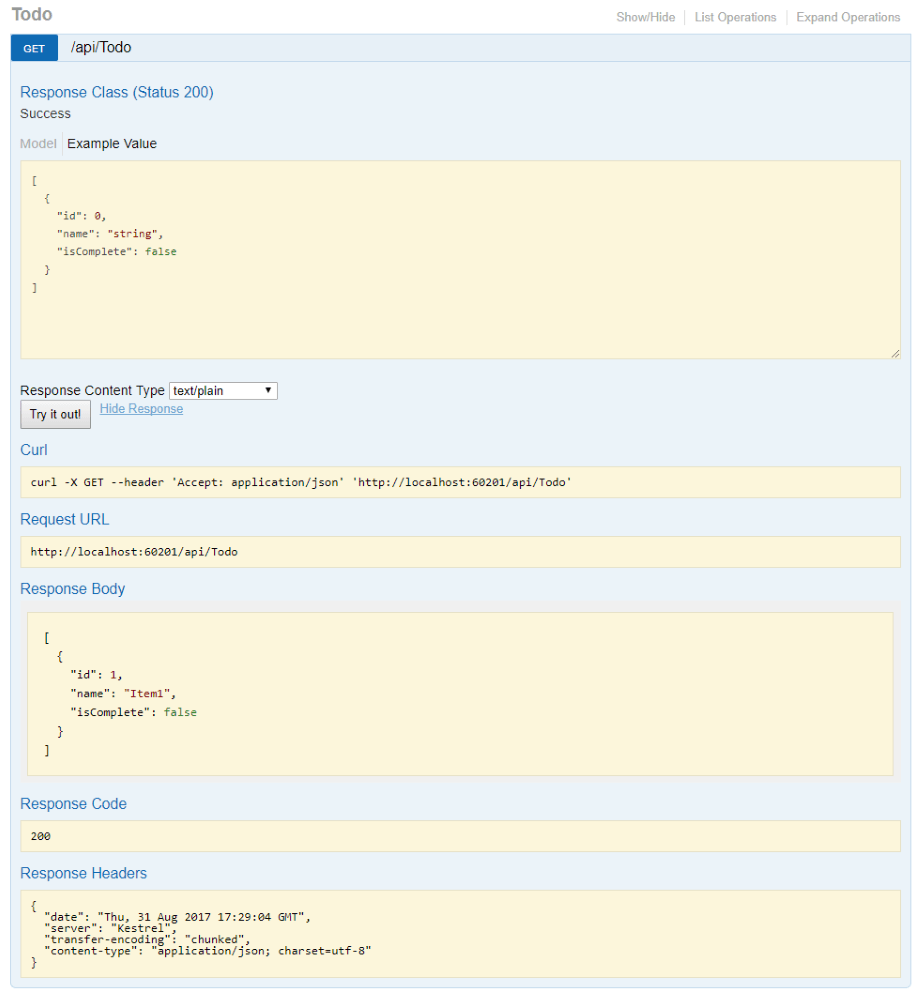

# OpenAPI

* [1. AppKey](#1-appkey)
* [2. OpenAPI](#2-openapi)
    * [2.1 Swagger](#21-swagger)
    * [2.2 Swagger 集成](#22-swagger-集成)
* [3. 开发SDK](#3-开发sdk)

## 1. AppKey
当我们将WebAPI对外网公开供所有开发者调用时，除了注意前面讲到[安全控制](webapi-security.md)之外，我们更常用`AppKey`来对开发者进行管理。

当一个开发者想基于我们开放的API开发一套第三方程序时，需要先到我们服务器申请一个`AppKey`，这枚`AppKey`即作为这个开发者的唯一身份标志，这个开发者开发的所有程序请求我们的API时都需要携带这枚`AppKey`。当我们发现某个开发者的程序有非法操作时，我们就可以在服务端禁用这枚`AppKey`，那此开发者的所有应用程序的请求API时都会被拒绝，但普通用户使用其他开发者的应用并不受影响。

如新浪微博官方开放了API，我们基于官方API开发一套第三方App名为"MyWeibo"。所有新浪微博注册用户都可以使用"MyWeibo"进行任何操作。某天新浪微博官方发现使用"MyWeibo"的用户发送微博都被加了恶意广告，则新浪微博官方直接封禁"MyWeibo"的`AppKey`即可，"MyWeibo"程序不可用，但所有用户仍可正常使用新浪官方微博程序或其他任意客户端使用新浪微博。

## 2. OpenAPI
### 2.1 Swagger
`Swagge`是一个与语言无关的规范，用于描述`REST API`。 `Swagger`项目已捐赠给`OpenAPI`计划，现在`Swagger`也称为`OpenAPI`。它允许计算机和人员了解服务的功能，而无需直接访问实现（源代码、网络访问、文档）。它解决了为 Web API 生成文档和帮助页的问题，具有诸如交互式文档、客户端 SDK 生成和 API 可发现性等优点。

#### 1) Swagger 规范
`Swagger`核心是`Swagger规范`，默认情况下体现为名为`swagger.json`的文档。它由`Swagger Tool Chain`（或其第三方实现）根据你的服务生成。它描述了 API 的功能以及使用 HTTP 对其进行访问的方式。它驱动`Swagger UI`，并由工具链用来启用发现和客户端代码生成。下面是一个缩减的`Swagger 规范`示例：

```json
{
   "swagger": "2.0",
   "info": {
       "version": "v1",
       "title": "API V1"
   },
   "basePath": "/",
   "paths": {
       "/api/Todo": {
           "get": {
               "tags": [
                   "Todo"
               ],
               "operationId": "ApiTodoGet",
               "consumes": [],
               "produces": [
                   "text/plain",
                   "application/json",
                   "text/json"
               ],
               "responses": {
                   "200": {
                       "description": "Success",
                       "schema": {
                           "type": "array",
                           "items": {
                               "$ref": "#/definitions/TodoItem"
                           }
                       }
                   }
                }
           },
           "post": {
               ...
           }
       },
       "/api/Todo/{id}": {
           "get": {
               ...
           },
           "put": {
               ...
           },
           "delete": {
               ...
   },
   "definitions": {
       "TodoItem": {
           "type": "object",
            "properties": {
                "id": {
                    "format": "int64",
                    "type": "integer"
                },
                "name": {
                    "type": "string"
                },
                "isComplete": {
                    "default": false,
                    "type": "boolean"
                }
            }
       }
   },
   "securityDefinitions": {}
}
```
#### 2) Swagger UI
`Swagger UI`提供了基于`Web`的用户界面方便用户直观的查看使用`Swagger`规范内容。Web UI 如下所示：


控制器中的每个公共操作方法都在`Swagger UI`中进行测试。单击方法名称可以展开该部分。添加所有必要的参数，然后单击“试试看!”。



### 2.2 Swagger 集成
目前在.Net Core平台下比较流行的`Swagger`集成工具有`Swashbuckle`和`NSwag`。两者均包含 Swagger UI 的嵌入式版本，因此可使用中间件注册调用将该嵌入式版本托管在 ASP.NET Core 应用中。

* `Swashbuckle.AspNetCore` 是一个开源项目，用于生成 ASP.NET Core Web API 的 `Swagger` 文档。
* `NSwag` 是另一个用于生成 Swagger 文档并将 `Swagger UI` 或 ReDoc 集成到 ASP.NET Core Web API 中的开源项目。 此外，`NSwag` 还提供了为 API 生成 C# 和 TypeScript 客户端代码的方法。

这里我们选择`NSwag`为例做简述。
* 安装依赖Nuget包 `dotnet add package NSwag.AspNetCore`
* 配置 Swagger。
    ```csharp
    public void ConfigureServices(IServiceCollection services)
    {
        services.AddMvc();
        
        // 注册Swagger服务
        services.AddSwaggerDocument();
    }

    public void Configure(IApplicationBuilder app, IHostingEnvironment env)
    {
        //启用中间件生成 Swagger规范 和 Swagger UI 
        app.UseOpenApi();
        app.UseSwaggerUi3();
        
        app.UseMvc();
    }
    ```
* 查看`Swagger UI`。默认访问 http://localhost:5000/swagger


## 3. 开发SDK
开放API除了完善的API文档外，为了更加友好的用户体验，服务提供商还会为常用的技术平台提供SDK包。

SDK包的作用就是按照接口文档，把对所有API的HTTP请求用对应语言平台工具类的方式提供给开发者调用，使用SDK包之后开发者就可以像调用本地工具方法一样使用API，避免了自定义繁琐的HTTP请求等环节。

开发SDK方就是写一个工具包。完成SDK开发后可以共享出来共开发者使用，如.Net平台可以发不到Nuget。
