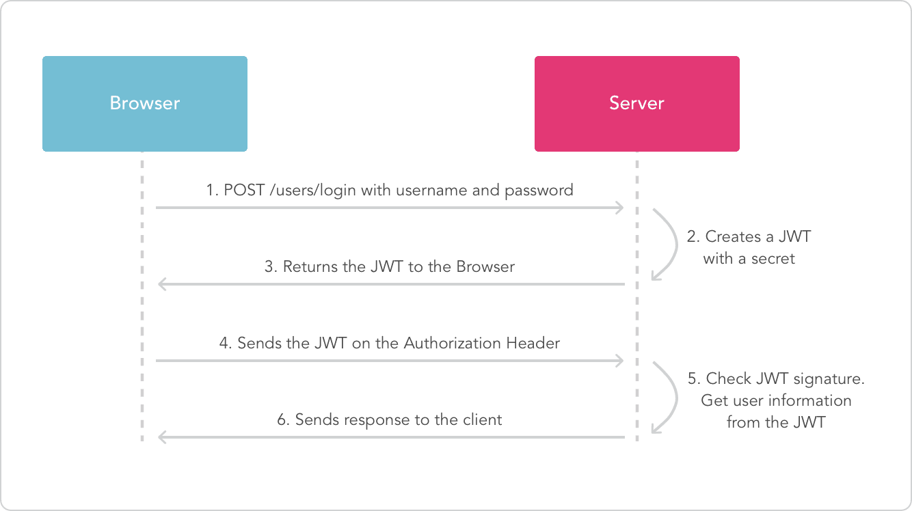
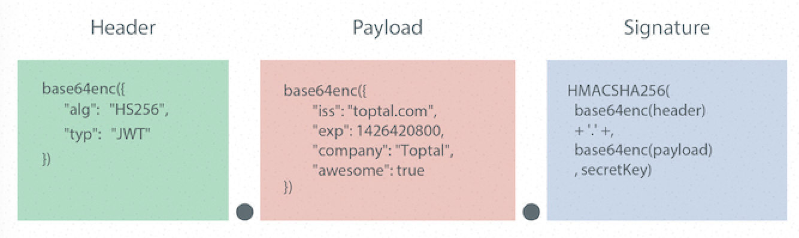

# API 安全控制

* [1. 安全传输](#1-安全传输)
* [2. 认证授权](#2-认证授权)
    * [2.1 Session](#21-session)
    * [2.2 JWT](#22-jwt)
    * [2.3 JWT 结构](#23-jwt-结构)
    * [2.4 JWT 操作](#24-jwt-操作)

## 1. 安全传输

* 认证授权。对API做认证授权，每次请求接口需要携带认证信息，如`JWT Token`
* 请求重放。重复请求一个接口，如充值接口。要避免重复业务处理。每次请求的时候都带着当前时间(时间戳),服务器端比 较一下如果这个时间和当前时间相差超过一定时间,则失效。因此最多被重放一段时间, 这个要求客户端的时间和服务器端的时间要保持相差不大。有些业务场景下要使用一次性验证。
* HTTPS。如果API暴露于外网建议使用HTTPS协议，可以增加被抓包难度。

## 2. 认证授权
认证授权是两个过程，简单说认证是告诉服务器你是谁，授权是服务器告诉你你可以做什么。关于服务端管理用户授权有很多的权限管理方式，这里我们就不做阐述了。这里我们主要看用户认证。

目前常用的认证方式有`Session`和`JWT`两种。 下面我们主要介绍两种认证方式的基本原理，两种认证默认都集成到Asp.Net Core中，具体使用方式，参见如下
* [Cookie-based 认证授权](authentication-cookie.md)
* [JWT 认证授权](authentication-jwt.md)

### 2.1 Session
前后端分离通过`Restful API`进行数据交互时，验证用户的登录信息及权限最传统的方式，前端提交用户名密码，后端验证通过后将用户信息记录到称为`Session`的内存区域中,`Session`是一个`key-value`集合，`key`一般名称为`session_id`唯一标识用户的一次会话，服务端会把`session_id`记录到`Cookie`中并返回给客户端，之后客户端每次请求都会带上这个`session_id`，服务端则可以根据`session_id`值来识别用户。

Session机制使用简单但也存在一些问题。
* 内存开销。每个用户经过我们的应用认证之后，我们的应用都要在服务端做一次记录，以方便用户下次请求的鉴别，通常而言`Session`都是保存在内存中，而随着认证用户的增多，服务端的开销会明显增大。
* 扩展性。用户认证之后，服务端做认证记录，如果认证的记录被保存在内存中的话，这意味着用户下次请求还必须要请求在这台服务器上,这样才能拿到授权的资源，这样在分布式的应用上，相应的限制了负载均衡器的能力。但是可以使用Redis等进程外`Session`来解决。
* 安全性。如果我们的页面出现了`XSS`漏洞，由于 `Cookie`可以被`JavaScript`读取导致`session_id`泄露，而作为后端识别用户的标识，`Cookie`的泄露意味着用户信息不再安全。设置 `httpOnly`后`Cookie`将不能被 JS 读取，那么`XSS`注入的问题也基本不用担心了。浏览器会自动的把它加在请求的`header`当中，设置`secure`的话，`Cookie`就只允许通过`HTTPS`传输。`secure`选项可以过滤掉一些使用`HTTP`协议的`XSS`注入，但并不能完全阻止，二期还存在`XSRF`风险。当你浏览器开着这个页面的时候，另一个页面可以很容易的跨站请求这个页面的内容。因为`Cookie`默认被发了出去。

### 2.2 JWT
`JWT`(JSON WEB TOKEN)是一个开放标准(RFC 7519)方法实现，用于通信双方之间安全认证。



1. 前端通过Web表单将自己的用户名和密码发送到后端的接口。这一过程一般是一个`HTTP POST`请求。建议的方式是通过SSL加密的传输（`https`协议），从而避免敏感信息被嗅探。
2. 服务端验证通过后将一些简单非敏感信息如`UserId`、`UserRole`等写到一个`Json`对象中并使用密钥签名后得到Token返回给客户端。
3. 前端可以将返回的`JWT Token`保存在`sessionStorage`上，退出登录时前端删除保存的JWT即可。
4. 前端每次请求将`JWT`放入`HTTP Header`中的Authorization位。(解决XSS和XSRF问题)
5. 后端验证JWT的有效性。例如，检查签名是否正确；检查Token是否过期；检查Token的接收方是否是自己（可选）。
6. 验证通过后后端使用JWT中包含的用户信息进行其他逻辑操作，返回相应结果。

优势：
* 跨语言支持
* 可以存储简单信息
* 易于扩展。不需要在服务端保存会话信息,易于应用扩展
* SSO。认证信息存在客户端，子系统无需再进行认证

劣势：
* 不能强制客户端下线
* 不可存储敏感信息
* `Secret`泄漏后不再安全

### 2.3 JWT 结构


如上图所示，`JWT`由`Header`、`Payload`、`Signature`三部分构成。

#### 1） Header

属性|含义
:-|:-
`alg`|声明加密的算法 通常使用`HMAC`或`SHA256`
`typ`|声明类型，这里是`JWT`

#### 2） Payload
这部分是我们存放信息的地方。 包含三个部分"标准注册声明"、"公共声明"、"私有声明"。

标准注册声明是固定名称，存放固定内容但不强制使用。

属性|含义
:-|:-
`iss`|签发者
`sub`|所面向的用户
`aud`|接收方
`exp`|过期时间，这个过期时间必须要大于签发时间
`nbf`|定义在什么时间之前，该jwt都是不可用的.
`iat`|签发时间
`jti`|唯一身份标识，主要用来作为**一次性token,从而回避重放攻击**。

公共声明可以添加任何的信息，一般添加用户的相关信息或其他业务需要的必要信息，但不建议添加敏感信息，因为该部分在客户端可解密。私有声明是提供者和消费者所共同定义的声明。

#### 3） Signature
这部分是防篡改签名。`base64`编码`Header`和`Payload`后使用`.`连接组成的字符串，然后通过`Header`中声明的加密方式进行加盐`SecretKey`组合加密，然后就构成了签名。

对头部以及负载内容进行签名，可以防止内容被窜改。虽然`Header`和`Payload`可以使用`base64`解码后得到明文，但由于不知道`SecretKey`所以客户端或任何第三方篡改内容后无法获得正确签名，服务端校验签名不正确便会得知认证内容被篡改了进而拒绝请求。

`SecretKey`保存在服务器端，用来进行`JWT`的签发和验证，务必确保其安全，一旦泄漏，任何人都可以自我签发`JWT`。

### 2.4 JWT 操作
```csharp
public static string CreateJwt(Dictionary<string, object> payload, string secret)
{
    var builder = new JwtBuilder()
        .WithAlgorithm(new HMACSHA256Algorithm())
        .WithSecret(secret);

    foreach (var key in payload.Keys)
        builder.AddClaim(key, payload[key]);

    return builder.Build();
}

public static bool VerifyJwt(string token, string secret, out IDictionary<string, object> payload)
{
    try
    {
        payload = new JwtBuilder()
            .WithSecret(secret)
            .MustVerifySignature()
            .Decode<IDictionary<string, object>>(token);

        return true;
    }
    catch (TokenExpiredException)
    {
        //JWT过期
        payload = null;
        return false;
    }
    catch (SignatureVerificationException)
    {
        //签名错误
        payload = null;
        return false;
    }
}
```
基于 https://github.com/jwt-dotnet/jwt


>参考文档：
* http://www.cnblogs.com/ldybyz/p/6943827.html
* https://www.jianshu.com/p/576dbf44b2ae
* https://lion1ou.win/2017/01/18/